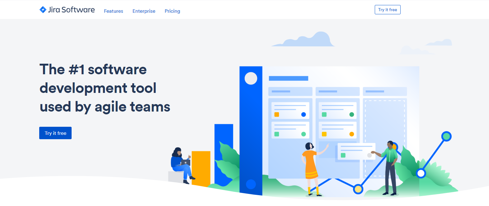

<div align="center">

[](https://www.atlassian.com&#x2F;software&#x2F;jira)

# [Atlassian](https://www.atlassian.com&#x2F;software&#x2F;jira)

Jira Cloud platform REST API documentation

</div>

## Requirements

Building the API client library requires:

1. Java 1.8+
2. Maven (3.8.3+)/Gradle (7.2+)

If you are adding this library to an Android Application or Library:

3. Android 8.0+ (API Level 26+)

## Installation<a id="installation"></a>
<div align="center">
  <a href="https://konfigthis.com/sdk-sign-up?company=Atlassian&serviceName=Jira&language=Java">
    
  </a>
</div>

### Maven users

Add this dependency to your project's POM:

```xml
<dependency>
  <groupId>com.konfigthis</groupId>
  <artifactId>atlassian-jira-java-sdk</artifactId>
  <version>1001.0.0-SNAPSHOT-9aad01a33a3dae75a5b6aedf98c77d2cbd2f865d</version>
  <scope>compile</scope>
</dependency>
```

### Gradle users

Add this dependency to your `build.gradle`:

```groovy
// build.gradle
repositories {
  mavenCentral()
}

dependencies {
   implementation "com.konfigthis:atlassian-jira-java-sdk:1001.0.0-SNAPSHOT-9aad01a33a3dae75a5b6aedf98c77d2cbd2f865d"
}
```

### Android users

Make sure your `build.gradle` file as a `minSdk` version of at least 26:
```groovy
// build.gradle
android {
    defaultConfig {
        minSdk 26
    }
}
```

Also make sure your library or application has internet permissions in your `AndroidManifest.xml`:

```xml
<!--AndroidManifest.xml-->
<?xml version="1.0" encoding="utf-8"?>
<manifest xmlns:android="http://schemas.android.com/apk/res/android"
    xmlns:tools="http://schemas.android.com/tools">
    <uses-permission android:name="android.permission.INTERNET"/>
</manifest>
```

### Others

At first generate the JAR by executing:

```shell
mvn clean package
```

Then manually install the following JARs:

* `target/atlassian-jira-java-sdk-1001.0.0-SNAPSHOT-9aad01a33a3dae75a5b6aedf98c77d2cbd2f865d.jar`
* `target/lib/*.jar`

## Getting Started

Please follow the [installation](#installation) instruction and execute the following Java code:

```java
import com.konfigthis.client.ApiClient;
import com.konfigthis.client.ApiException;
import com.konfigthis.client.ApiResponse;
import com.konfigthis.client.AtlassianJira;
import com.konfigthis.client.Configuration;
import com.konfigthis.client.auth.*;
import com.konfigthis.client.model.*;
import com.konfigthis.client.api.AnnouncementBannerApi;
import java.util.List;
import java.util.Map;
import java.util.UUID;

public class Example {
  public static void main(String[] args) {
    Configuration configuration = new Configuration();
    configuration.host = "https://your-domain.atlassian.net";
    
    // Configure OAuth2 access token for authorization: OAuth2
    configuration.accessToken = "YOUR ACCESS TOKEN";
    
    // Configure HTTP basic authorization: basicAuth
    configuration.username = "YOUR USERNAME";
    configuration.password = "YOUR PASSWORD";
    AtlassianJira client = new AtlassianJira(configuration);
    try {
      AnnouncementBannerConfiguration result = client
              .announcementBanner
              .getConfiguration()
              .execute();
      System.out.println(result);
      System.out.println(result.getHashId());
      System.out.println(result.getIsDismissible());
      System.out.println(result.getIsEnabled());
      System.out.println(result.getMessage());
      System.out.println(result.getVisibility());
    } catch (ApiException e) {
      System.err.println("Exception when calling AnnouncementBannerApi#getConfiguration");
      System.err.println("Status code: " + e.getStatusCode());
      System.err.println("Reason: " + e.getResponseBody());
      System.err.println("Response headers: " + e.getResponseHeaders());
      e.printStackTrace();
    }

    // Use .executeWithHttpInfo() to retrieve HTTP Status Code, Headers and Request
    try {
      ApiResponse<AnnouncementBannerConfiguration> response = client
              .announcementBanner
              .getConfiguration()
              .executeWithHttpInfo();
      System.out.println(response.getResponseBody());
      System.out.println(response.getResponseHeaders());
      System.out.println(response.getStatusCode());
      System.out.println(response.getRoundTripTime());
      System.out.println(response.getRequest());
    } catch (ApiException e) {
      System.err.println("Exception when calling AnnouncementBannerApi#getConfiguration");
      System.err.println("Status code: " + e.getStatusCode());
      System.err.println("Reason: " + e.getResponseBody());
      System.err.println("Response headers: " + e.getResponseHeaders());
      e.printStackTrace();
    }
  }
}

```

## Documentation for API Endpoints

All URIs are relative to *https://your-domain.atlassian.net*

Class | Method | HTTP request | Description
------------ | ------------- | ------------- | -------------
*AnnouncementBannerApi* | [**getConfiguration**](docs/AnnouncementBannerApi.md#getConfiguration) | **GET** /rest/api/3/announcementBanner | Get announcement banner configuration
*AnnouncementBannerApi* | [**updateConfiguration**](docs/AnnouncementBannerApi.md#updateConfiguration) | **PUT** /rest/api/3/announcementBanner | Update announcement banner configuration
*AppDataPoliciesEapApi* | [**getDataPolicyProjects**](docs/AppDataPoliciesEapApi.md#getDataPolicyProjects) | **GET** /rest/api/3/data-policy/project | Get data policy for projects (EAP)
*AppDataPoliciesEapApi* | [**getDataPolicyWorkspace**](docs/AppDataPoliciesEapApi.md#getDataPolicyWorkspace) | **GET** /rest/api/3/data-policy | Get data policy for the workspace (EAP)
*AppMigrationApi* | [**bulkUpdateEntityProperties**](docs/AppMigrationApi.md#bulkUpdateEntityProperties) | **PUT** /rest/atlassian-connect/1/migration/properties/{entityType} | Bulk update entity properties
*AppMigrationApi* | [**updateCustomFieldValue**](docs/AppMigrationApi.md#updateCustomFieldValue) | **PUT** /rest/atlassian-connect/1/migration/field | Bulk update custom field value
*AppMigrationApi* | [**workflowTransitionRuleConfigurations**](docs/AppMigrationApi.md#workflowTransitionRuleConfigurations) | **POST** /rest/atlassian-connect/1/migration/workflow/rule/search | Get workflow transition rule configurations
*AppPropertiesApi* | [**deleteForgeProperty**](docs/AppPropertiesApi.md#deleteForgeProperty) | **DELETE** /rest/forge/1/app/properties/{propertyKey} | Delete app property (Forge)
*AppPropertiesApi* | [**deleteProperty**](docs/AppPropertiesApi.md#deleteProperty) | **DELETE** /rest/atlassian-connect/1/addons/{addonKey}/properties/{propertyKey} | Delete app property
*AppPropertiesApi* | [**getAllProperties**](docs/AppPropertiesApi.md#getAllProperties) | **GET** /rest/atlassian-connect/1/addons/{addonKey}/properties | Get app properties
*AppPropertiesApi* | [**getByKeyAndValue**](docs/AppPropertiesApi.md#getByKeyAndValue) | **GET** /rest/atlassian-connect/1/addons/{addonKey}/properties/{propertyKey} | Get app property
*AppPropertiesApi* | [**setAppProperty**](docs/AppPropertiesApi.md#setAppProperty) | **PUT** /rest/atlassian-connect/1/addons/{addonKey}/properties/{propertyKey} | Set app property
*AppPropertiesApi* | [**setForgeProperty**](docs/AppPropertiesApi.md#setForgeProperty) | **PUT** /rest/forge/1/app/properties/{propertyKey} | Set app property (Forge)
*ApplicationRolesApi* | [**getAll**](docs/ApplicationRolesApi.md#getAll) | **GET** /rest/api/3/applicationrole | Get all application roles
*ApplicationRolesApi* | [**getRole**](docs/ApplicationRolesApi.md#getRole) | **GET** /rest/api/3/applicationrole/{key} | Get application role
*AuditRecordsApi* | [**getAuditRecords**](docs/AuditRecordsApi.md#getAuditRecords) | **GET** /rest/api/3/auditing/record | Get audit records
*AvatarsApi* | [**deleteAvatar**](docs/AvatarsApi.md#deleteAvatar) | **DELETE** /rest/api/3/universal_avatar/type/{type}/owner/{owningObjectId}/avatar/{id} | Delete avatar
*AvatarsApi* | [**getAvatarImageById**](docs/AvatarsApi.md#getAvatarImageById) | **GET** /rest/api/3/universal_avatar/view/type/{type}/avatar/{id} | Get avatar image by ID
*AvatarsApi* | [**getAvatarImageByOwner**](docs/AvatarsApi.md#getAvatarImageByOwner) | **GET** /rest/api/3/universal_avatar/view/type/{type}/owner/{entityId} | Get avatar image by owner
*AvatarsApi* | [**getDefaultAvatarImageByType**](docs/AvatarsApi.md#getDefaultAvatarImageByType) | **GET** /rest/api/3/universal_avatar/view/type/{type} | Get avatar image by type
*AvatarsApi* | [**getSystemAndCustomAvatarsByType**](docs/AvatarsApi.md#getSystemAndCustomAvatarsByType) | **GET** /rest/api/3/universal_avatar/type/{type}/owner/{entityId} | Get avatars
*AvatarsApi* | [**getSystemAvatarsByType**](docs/AvatarsApi.md#getSystemAvatarsByType) | **GET** /rest/api/3/avatar/{type}/system | Get system avatars by type
*AvatarsApi* | [**loadCustomAvatarForProjectOrIssueType**](docs/AvatarsApi.md#loadCustomAvatarForProjectOrIssueType) | **POST** /rest/api/3/universal_avatar/type/{type}/owner/{entityId} | Load avatar
*ClassificationLevelsApi* | [**getAll**](docs/ClassificationLevelsApi.md#getAll) | **GET** /rest/api/3/classification-levels | Get all classification levels
*DashboardsApi* | [**addGadgetToDashboard**](docs/DashboardsApi.md#addGadgetToDashboard) | **POST** /rest/api/3/dashboard/{dashboardId}/gadget | Add gadget to dashboard
*DashboardsApi* | [**copyDashboard**](docs/DashboardsApi.md#copyDashboard) | **POST** /rest/api/3/dashboard/{id}/copy | Copy dashboard
*DashboardsApi* | [**createDashboard**](docs/DashboardsApi.md#createDashboard) | **POST** /rest/api/3/dashboard | Create dashboard
*DashboardsApi* | [**deleteItemProperty**](docs/DashboardsApi.md#deleteItemProperty) | **DELETE** /rest/api/3/dashboard/{dashboardId}/items/{itemId}/properties/{propertyKey} | Delete dashboard item property
*DashboardsApi* | [**editBulkDashboards**](docs/DashboardsApi.md#editBulkDashboards) | **PUT** /rest/api/3/dashboard/bulk/edit | Bulk edit dashboards
*DashboardsApi* | [**getAll**](docs/DashboardsApi.md#getAll) | **GET** /rest/api/3/dashboard | Get all dashboards
*DashboardsApi* | [**getById**](docs/DashboardsApi.md#getById) | **GET** /rest/api/3/dashboard/{id} | Get dashboard
*DashboardsApi* | [**getDashboardItemPropertyKeys**](docs/DashboardsApi.md#getDashboardItemPropertyKeys) | **GET** /rest/api/3/dashboard/{dashboardId}/items/{itemId}/properties | Get dashboard item property keys
*DashboardsApi* | [**getItemProperty**](docs/DashboardsApi.md#getItemProperty) | **GET** /rest/api/3/dashboard/{dashboardId}/items/{itemId}/properties/{propertyKey} | Get dashboard item property
*DashboardsApi* | [**listAvailableGadgets**](docs/DashboardsApi.md#listAvailableGadgets) | **GET** /rest/api/3/dashboard/gadgets | Get available gadgets
*DashboardsApi* | [**listGadgets**](docs/DashboardsApi.md#listGadgets) | **GET** /rest/api/3/dashboard/{dashboardId}/gadget | Get gadgets
*DashboardsApi* | [**removeById**](docs/DashboardsApi.md#removeById) | **DELETE** /rest/api/3/dashboard/{id} | Delete dashboard
*DashboardsApi* | [**removeGadgetFromDashboard**](docs/DashboardsApi.md#removeGadgetFromDashboard) | **DELETE** /rest/api/3/dashboard/{dashboardId}/gadget/{gadgetId} | Remove gadget from dashboard
*DashboardsApi* | [**search**](docs/DashboardsApi.md#search) | **GET** /rest/api/3/dashboard/search | Search for dashboards
*DashboardsApi* | [**setItemProperty**](docs/DashboardsApi.md#setItemProperty) | **PUT** /rest/api/3/dashboard/{dashboardId}/items/{itemId}/properties/{propertyKey} | Set dashboard item property
*DashboardsApi* | [**updateDetails**](docs/DashboardsApi.md#updateDetails) | **PUT** /rest/api/3/dashboard/{id} | Update dashboard
*DashboardsApi* | [**updateGadgetOnDashboard**](docs/DashboardsApi.md#updateGadgetOnDashboard) | **PUT** /rest/api/3/dashboard/{dashboardId}/gadget/{gadgetId} | Update gadget on dashboard
*DynamicModulesApi* | [**getAllRegisteredModules**](docs/DynamicModulesApi.md#getAllRegisteredModules) | **GET** /rest/atlassian-connect/1/app/module/dynamic | Get modules
*DynamicModulesApi* | [**registerModules**](docs/DynamicModulesApi.md#registerModules) | **POST** /rest/atlassian-connect/1/app/module/dynamic | Register modules
*DynamicModulesApi* | [**remove**](docs/DynamicModulesApi.md#remove) | **DELETE** /rest/atlassian-connect/1/app/module/dynamic | Remove modules
*FilterSharingApi* | [**addSharePermission**](docs/FilterSharingApi.md#addSharePermission) | **POST** /rest/api/3/filter/{id}/permission | Add share permission
*FilterSharingApi* | [**deleteSharePermission**](docs/FilterSharingApi.md#deleteSharePermission) | **DELETE** /rest/api/3/filter/{id}/permission/{permissionId} | Delete share permission
*FilterSharingApi* | [**getDefaultShareScope**](docs/FilterSharingApi.md#getDefaultShareScope) | **GET** /rest/api/3/filter/defaultShareScope | Get default share scope
*FilterSharingApi* | [**getSharePermission**](docs/FilterSharingApi.md#getSharePermission) | **GET** /rest/api/3/filter/{id}/permission/{permissionId} | Get share permission
*FilterSharingApi* | [**getSharePermissions**](docs/FilterSharingApi.md#getSharePermissions) | **GET** /rest/api/3/filter/{id}/permission | Get share permissions
*FilterSharingApi* | [**setDefaultShareScope**](docs/FilterSharingApi.md#setDefaultShareScope) | **PUT** /rest/api/3/filter/defaultShareScope | Set default share scope
*FiltersApi* | [**addAsFavorite**](docs/FiltersApi.md#addAsFavorite) | **PUT** /rest/api/3/filter/{id}/favourite | Add filter as favorite
*FiltersApi* | [**changeFilterOwner**](docs/FiltersApi.md#changeFilterOwner) | **PUT** /rest/api/3/filter/{id}/owner | Change filter owner
*FiltersApi* | [**createFilter**](docs/FiltersApi.md#createFilter) | **POST** /rest/api/3/filter | Create filter
*FiltersApi* | [**deleteFilterById**](docs/FiltersApi.md#deleteFilterById) | **DELETE** /rest/api/3/filter/{id} | Delete filter
*FiltersApi* | [**getById**](docs/FiltersApi.md#getById) | **GET** /rest/api/3/filter/{id} | Get filter
*FiltersApi* | [**getFilterColumns**](docs/FiltersApi.md#getFilterColumns) | **GET** /rest/api/3/filter/{id}/columns | Get columns
*FiltersApi* | [**getUserFilters**](docs/FiltersApi.md#getUserFilters) | **GET** /rest/api/3/filter/my | Get my filters
*FiltersApi* | [**listFavoriteFilters**](docs/FiltersApi.md#listFavoriteFilters) | **GET** /rest/api/3/filter/favourite | Get favorite filters
*FiltersApi* | [**removeFavorite**](docs/FiltersApi.md#removeFavorite) | **DELETE** /rest/api/3/filter/{id}/favourite | Remove filter as favorite
*FiltersApi* | [**resetColumns**](docs/FiltersApi.md#resetColumns) | **DELETE** /rest/api/3/filter/{id}/columns | Reset columns
*FiltersApi* | [**search**](docs/FiltersApi.md#search) | **GET** /rest/api/3/filter/search | Search for filters
*FiltersApi* | [**setColumns**](docs/FiltersApi.md#setColumns) | **PUT** /rest/api/3/filter/{id}/columns | Set columns
*FiltersApi* | [**updateFilterById**](docs/FiltersApi.md#updateFilterById) | **PUT** /rest/api/3/filter/{id} | Update filter
*GroupAndUserPickerApi* | [**findMatchingUsersAndGroups**](docs/GroupAndUserPickerApi.md#findMatchingUsersAndGroups) | **GET** /rest/api/3/groupuserpicker | Find users and groups
*GroupsApi* | [**addUserToGroup**](docs/GroupsApi.md#addUserToGroup) | **POST** /rest/api/3/group/user | Add user to group
*GroupsApi* | [**createGroup**](docs/GroupsApi.md#createGroup) | **POST** /rest/api/3/group | Create group
*GroupsApi* | [**findMatchingGroups**](docs/GroupsApi.md#findMatchingGroups) | **GET** /rest/api/3/groups/picker | Find groups
*GroupsApi* | [**getGroupMembers**](docs/GroupsApi.md#getGroupMembers) | **GET** /rest/api/3/group | Get group
*GroupsApi* | [**getGroupMembers_0**](docs/GroupsApi.md#getGroupMembers_0) | **GET** /rest/api/3/group/member | Get users from group
*GroupsApi* | [**getPaginatedList**](docs/GroupsApi.md#getPaginatedList) | **GET** /rest/api/3/group/bulk | Bulk get groups
*GroupsApi* | [**removeGroup**](docs/GroupsApi.md#removeGroup) | **DELETE** /rest/api/3/group | Remove group
*GroupsApi* | [**removeUserFromGroup**](docs/GroupsApi.md#removeUserFromGroup) | **DELETE** /rest/api/3/group/user | Remove user from group
*IssueAttachmentsApi* | [**addAttachment**](docs/IssueAttachmentsApi.md#addAttachment) | **POST** /rest/api/3/issue/{issueIdOrKey}/attachments | Add attachment
*IssueAttachmentsApi* | [**deleteAttachment**](docs/IssueAttachmentsApi.md#deleteAttachment) | **DELETE** /rest/api/3/attachment/{id} | Delete attachment
*IssueAttachmentsApi* | [**expandHumanMetadata**](docs/IssueAttachmentsApi.md#expandHumanMetadata) | **GET** /rest/api/3/attachment/{id}/expand/human | Get all metadata for an expanded attachment
*IssueAttachmentsApi* | [**expandRaw**](docs/IssueAttachmentsApi.md#expandRaw) | **GET** /rest/api/3/attachment/{id}/expand/raw | Get contents metadata for an expanded attachment
*IssueAttachmentsApi* | [**getContent**](docs/IssueAttachmentsApi.md#getContent) | **GET** /rest/api/3/attachment/content/{id} | Get attachment content
*IssueAttachmentsApi* | [**getMetadata**](docs/IssueAttachmentsApi.md#getMetadata) | **GET** /rest/api/3/attachment/{id} | Get attachment metadata
*IssueAttachmentsApi* | [**getSettings**](docs/IssueAttachmentsApi.md#getSettings) | **GET** /rest/api/3/attachment/meta | Get Jira attachment settings
*IssueAttachmentsApi* | [**getThumbnail**](docs/IssueAttachmentsApi.md#getThumbnail) | **GET** /rest/api/3/attachment/thumbnail/{id} | Get attachment thumbnail
*IssueCommentPropertiesApi* | [**deleteCommentProperty**](docs/IssueCommentPropertiesApi.md#deleteCommentProperty) | **DELETE** /rest/api/3/comment/{commentId}/properties/{propertyKey} | Delete comment property
*IssueCommentPropertiesApi* | [**getKeys**](docs/IssueCommentPropertiesApi.md#getKeys) | **GET** /rest/api/3/comment/{commentId}/properties | Get comment property keys
*IssueCommentPropertiesApi* | [**getPropertyValue**](docs/IssueCommentPropertiesApi.md#getPropertyValue) | **GET** /rest/api/3/comment/{commentId}/properties/{propertyKey} | Get comment property
*IssueCommentPropertiesApi* | [**setPropertyValue**](docs/IssueCommentPropertiesApi.md#setPropertyValue) | **PUT** /rest/api/3/comment/{commentId}/properties/{propertyKey} | Set comment property
*IssueCommentsApi* | [**addCommentToIssue**](docs/IssueCommentsApi.md#addCommentToIssue) | **POST** /rest/api/3/issue/{issueIdOrKey}/comment | Add comment
*IssueCommentsApi* | [**deleteComment**](docs/IssueCommentsApi.md#deleteComment) | **DELETE** /rest/api/3/issue/{issueIdOrKey}/comment/{id} | Delete comment
*IssueCommentsApi* | [**getCommentById**](docs/IssueCommentsApi.md#getCommentById) | **GET** /rest/api/3/issue/{issueIdOrKey}/comment/{id} | Get comment
*IssueCommentsApi* | [**getCommentsByIds**](docs/IssueCommentsApi.md#getCommentsByIds) | **POST** /rest/api/3/comment/list | Get comments by IDs
*IssueCommentsApi* | [**listGet**](docs/IssueCommentsApi.md#listGet) | **GET** /rest/api/3/issue/{issueIdOrKey}/comment | Get comments
*IssueCommentsApi* | [**updateComment**](docs/IssueCommentsApi.md#updateComment) | **PUT** /rest/api/3/issue/{issueIdOrKey}/comment/{id} | Update comment
*IssueCustomFieldConfigurationAppsApi* | [**getContextConfiguration**](docs/IssueCustomFieldConfigurationAppsApi.md#getContextConfiguration) | **GET** /rest/api/3/app/field/{fieldIdOrKey}/context/configuration | Get custom field configurations
*IssueCustomFieldConfigurationAppsApi* | [**updateContextConfiguration**](docs/IssueCustomFieldConfigurationAppsApi.md#updateContextConfiguration) | **PUT** /rest/api/3/app/field/{fieldIdOrKey}/context/configuration | Update custom field configurations
*IssueCustomFieldContextsApi* | [**addIssueTypesToContext**](docs/IssueCustomFieldContextsApi.md#addIssueTypesToContext) | **PUT** /rest/api/3/field/{fieldId}/context/{contextId}/issuetype | Add issue types to context
*IssueCustomFieldContextsApi* | [**assignContextsToProjects**](docs/IssueCustomFieldContextsApi.md#assignContextsToProjects) | **PUT** /rest/api/3/field/{fieldId}/context/{contextId}/project | Assign custom field context to projects
*IssueCustomFieldContextsApi* | [**createCustomFieldContext**](docs/IssueCustomFieldContextsApi.md#createCustomFieldContext) | **POST** /rest/api/3/field/{fieldId}/context | Create custom field context
*IssueCustomFieldContextsApi* | [**deleteCustomFieldContext**](docs/IssueCustomFieldContextsApi.md#deleteCustomFieldContext) | **DELETE** /rest/api/3/field/{fieldId}/context/{contextId} | Delete custom field context
*IssueCustomFieldContextsApi* | [**getCustomFieldContextsForProjectsAndIssueTypes**](docs/IssueCustomFieldContextsApi.md#getCustomFieldContextsForProjectsAndIssueTypes) | **POST** /rest/api/3/field/{fieldId}/context/mapping | Get custom field contexts for projects and issue types
*IssueCustomFieldContextsApi* | [**getDefaultValues**](docs/IssueCustomFieldContextsApi.md#getDefaultValues) | **GET** /rest/api/3/field/{fieldId}/context/defaultValue | Get custom field contexts default values
*IssueCustomFieldContextsApi* | [**getIssueTypeMappingsForContexts**](docs/IssueCustomFieldContextsApi.md#getIssueTypeMappingsForContexts) | **GET** /rest/api/3/field/{fieldId}/context/issuetypemapping | Get issue types for custom field context
*IssueCustomFieldContextsApi* | [**getProjectContextMapping**](docs/IssueCustomFieldContextsApi.md#getProjectContextMapping) | **GET** /rest/api/3/field/{fieldId}/context/projectmapping | Get project mappings for custom field context
*IssueCustomFieldContextsApi* | [**listCustomFieldContexts**](docs/IssueCustomFieldContextsApi.md#listCustomFieldContexts) | **GET** /rest/api/3/field/{fieldId}/context | Get custom field contexts
*IssueCustomFieldContextsApi* | [**removeCustomFieldContextFromProjects**](docs/IssueCustomFieldContextsApi.md#removeCustomFieldContextFromProjects) | **POST** /rest/api/3/field/{fieldId}/context/{contextId}/project/remove | Remove custom field context from projects
*IssueCustomFieldContextsApi* | [**removeIssueTypesFromContext**](docs/IssueCustomFieldContextsApi.md#removeIssueTypesFromContext) | **POST** /rest/api/3/field/{fieldId}/context/{contextId}/issuetype/remove | Remove issue types from context
*IssueCustomFieldContextsApi* | [**setDefaultValues**](docs/IssueCustomFieldContextsApi.md#setDefaultValues) | **PUT** /rest/api/3/field/{fieldId}/context/defaultValue | Set custom field contexts default values
*IssueCustomFieldContextsApi* | [**updateCustomFieldContext**](docs/IssueCustomFieldContextsApi.md#updateCustomFieldContext) | **PUT** /rest/api/3/field/{fieldId}/context/{contextId} | Update custom field context
*IssueCustomFieldOptionsApi* | [**createCustomFieldOption**](docs/IssueCustomFieldOptionsApi.md#createCustomFieldOption) | **POST** /rest/api/3/field/{fieldId}/context/{contextId}/option | Create custom field options (context)
*IssueCustomFieldOptionsApi* | [**deleteCustomFieldOption**](docs/IssueCustomFieldOptionsApi.md#deleteCustomFieldOption) | **DELETE** /rest/api/3/field/{fieldId}/context/{contextId}/option/{optionId} | Delete custom field options (context)
*IssueCustomFieldOptionsApi* | [**getContextOptions**](docs/IssueCustomFieldOptionsApi.md#getContextOptions) | **GET** /rest/api/3/field/{fieldId}/context/{contextId}/option | Get custom field options (context)
*IssueCustomFieldOptionsApi* | [**getOptionById**](docs/IssueCustomFieldOptionsApi.md#getOptionById) | **GET** /rest/api/3/customFieldOption/{id} | Get custom field option
*IssueCustomFieldOptionsApi* | [**reorderCustomFieldOptions**](docs/IssueCustomFieldOptionsApi.md#reorderCustomFieldOptions) | **PUT** /rest/api/3/field/{fieldId}/context/{contextId}/option/move | Reorder custom field options (context)
*IssueCustomFieldOptionsApi* | [**replaceOptions**](docs/IssueCustomFieldOptionsApi.md#replaceOptions) | **DELETE** /rest/api/3/field/{fieldId}/context/{contextId}/option/{optionId}/issue | Replace custom field options
*IssueCustomFieldOptionsApi* | [**updateContextOption**](docs/IssueCustomFieldOptionsApi.md#updateContextOption) | **PUT** /rest/api/3/field/{fieldId}/context/{contextId}/option | Update custom field options (context)
*IssueCustomFieldOptionsAppsApi* | [**createFieldOption**](docs/IssueCustomFieldOptionsAppsApi.md#createFieldOption) | **POST** /rest/api/3/field/{fieldKey}/option | Create issue field option
*IssueCustomFieldOptionsAppsApi* | [**deleteOption**](docs/IssueCustomFieldOptionsAppsApi.md#deleteOption) | **DELETE** /rest/api/3/field/{fieldKey}/option/{optionId} | Delete issue field option
*IssueCustomFieldOptionsAppsApi* | [**deselectOptionFromIssues**](docs/IssueCustomFieldOptionsAppsApi.md#deselectOptionFromIssues) | **DELETE** /rest/api/3/field/{fieldKey}/option/{optionId}/issue | Replace issue field option
*IssueCustomFieldOptionsAppsApi* | [**getAllIssueFieldOptions**](docs/IssueCustomFieldOptionsAppsApi.md#getAllIssueFieldOptions) | **GET** /rest/api/3/field/{fieldKey}/option | Get all issue field options
*IssueCustomFieldOptionsAppsApi* | [**getIssueFieldOption**](docs/IssueCustomFieldOptionsAppsApi.md#getIssueFieldOption) | **GET** /rest/api/3/field/{fieldKey}/option/{optionId} | Get issue field option
*IssueCustomFieldOptionsAppsApi* | [**getSelectableIssueFieldOptions**](docs/IssueCustomFieldOptionsAppsApi.md#getSelectableIssueFieldOptions) | **GET** /rest/api/3/field/{fieldKey}/option/suggestions/edit | Get selectable issue field options
*IssueCustomFieldOptionsAppsApi* | [**getVisibleIssueFieldOptions**](docs/IssueCustomFieldOptionsAppsApi.md#getVisibleIssueFieldOptions) | **GET** /rest/api/3/field/{fieldKey}/option/suggestions/search | Get visible issue field options
*IssueCustomFieldOptionsAppsApi* | [**updateOptionById**](docs/IssueCustomFieldOptionsAppsApi.md#updateOptionById) | **PUT** /rest/api/3/field/{fieldKey}/option/{optionId} | Update issue field option
*IssueCustomFieldValuesAppsApi* | [**updateValue**](docs/IssueCustomFieldValuesAppsApi.md#updateValue) | **PUT** /rest/api/3/app/field/{fieldIdOrKey}/value | Update custom field value
*IssueCustomFieldValuesAppsApi* | [**updateValues**](docs/IssueCustomFieldValuesAppsApi.md#updateValues) | **POST** /rest/api/3/app/field/value | Update custom fields
*IssueFieldConfigurationsApi* | [**assignFieldConfigurationSchemeToProject**](docs/IssueFieldConfigurationsApi.md#assignFieldConfigurationSchemeToProject) | **PUT** /rest/api/3/fieldconfigurationscheme/project | Assign field configuration scheme to project
*IssueFieldConfigurationsApi* | [**assignIssueTypesToFieldConfigurationScheme**](docs/IssueFieldConfigurationsApi.md#assignIssueTypesToFieldConfigurationScheme) | **PUT** /rest/api/3/fieldconfigurationscheme/{id}/mapping | Assign issue types to field configurations
*IssueFieldConfigurationsApi* | [**createFieldConfiguration**](docs/IssueFieldConfigurationsApi.md#createFieldConfiguration) | **POST** /rest/api/3/fieldconfiguration | Create field configuration
*IssueFieldConfigurationsApi* | [**createFieldConfigurationScheme**](docs/IssueFieldConfigurationsApi.md#createFieldConfigurationScheme) | **POST** /rest/api/3/fieldconfigurationscheme | Create field configuration scheme
*IssueFieldConfigurationsApi* | [**deleteFieldConfiguration**](docs/IssueFieldConfigurationsApi.md#deleteFieldConfiguration) | **DELETE** /rest/api/3/fieldconfiguration/{id} | Delete field configuration
*IssueFieldConfigurationsApi* | [**deleteScheme**](docs/IssueFieldConfigurationsApi.md#deleteScheme) | **DELETE** /rest/api/3/fieldconfigurationscheme/{id} | Delete field configuration scheme
*IssueFieldConfigurationsApi* | [**getAllFieldConfigurations**](docs/IssueFieldConfigurationsApi.md#getAllFieldConfigurations) | **GET** /rest/api/3/fieldconfiguration | Get all field configurations
*IssueFieldConfigurationsApi* | [**getConfigurationItems**](docs/IssueFieldConfigurationsApi.md#getConfigurationItems) | **GET** /rest/api/3/fieldconfiguration/{id}/fields | Get field configuration items
*IssueFieldConfigurationsApi* | [**getConfigurationSchemeMapping**](docs/IssueFieldConfigurationsApi.md#getConfigurationSchemeMapping) | **GET** /rest/api/3/fieldconfigurationscheme/mapping | Get field configuration issue type items
*IssueFieldConfigurationsApi* | [**getFieldConfigurationSchemesForProjects**](docs/IssueFieldConfigurationsApi.md#getFieldConfigurationSchemesForProjects) | **GET** /rest/api/3/fieldconfigurationscheme/project | Get field configuration schemes for projects
*IssueFieldConfigurationsApi* | [**listFieldConfigurationSchemes**](docs/IssueFieldConfigurationsApi.md#listFieldConfigurationSchemes) | **GET** /rest/api/3/fieldconfigurationscheme | Get all field configuration schemes
*IssueFieldConfigurationsApi* | [**removeIssueTypesFromFieldConfigScheme**](docs/IssueFieldConfigurationsApi.md#removeIssueTypesFromFieldConfigScheme) | **POST** /rest/api/3/fieldconfigurationscheme/{id}/mapping/delete | Remove issue types from field configuration scheme
*IssueFieldConfigurationsApi* | [**updateFieldConfigItems**](docs/IssueFieldConfigurationsApi.md#updateFieldConfigItems) | **PUT** /rest/api/3/fieldconfiguration/{id}/fields | Update field configuration items
*IssueFieldConfigurationsApi* | [**updateFieldConfiguration**](docs/IssueFieldConfigurationsApi.md#updateFieldConfiguration) | **PUT** /rest/api/3/fieldconfiguration/{id} | Update field configuration
*IssueFieldConfigurationsApi* | [**updateScheme**](docs/IssueFieldConfigurationsApi.md#updateScheme) | **PUT** /rest/api/3/fieldconfigurationscheme/{id} | Update field configuration scheme
*IssueFieldsApi* | [**createCustomField**](docs/IssueFieldsApi.md#createCustomField) | **POST** /rest/api/3/field | Create custom field
*IssueFieldsApi* | [**deleteCustomField**](docs/IssueFieldsApi.md#deleteCustomField) | **DELETE** /rest/api/3/field/{id} | Delete custom field
*IssueFieldsApi* | [**getContextsForField**](docs/IssueFieldsApi.md#getContextsForField) | **GET** /rest/api/3/field/{fieldId}/contexts | Get contexts for a field
*IssueFieldsApi* | [**getFieldsPaginated**](docs/IssueFieldsApi.md#getFieldsPaginated) | **GET** /rest/api/3/field/search | Get fields paginated
*IssueFieldsApi* | [**getSystemAndCustomFields**](docs/IssueFieldsApi.md#getSystemAndCustomFields) | **GET** /rest/api/3/field | Get fields
*IssueFieldsApi* | [**listFieldsInTrashPaginated**](docs/IssueFieldsApi.md#listFieldsInTrashPaginated) | **GET** /rest/api/3/field/search/trashed | Get fields in trash paginated
*IssueFieldsApi* | [**moveCustomFieldToTrash**](docs/IssueFieldsApi.md#moveCustomFieldToTrash) | **POST** /rest/api/3/field/{id}/trash | Move custom field to trash
*IssueFieldsApi* | [**restoreCustomFieldFromTrash**](docs/IssueFieldsApi.md#restoreCustomFieldFromTrash) | **POST** /rest/api/3/field/{id}/restore | Restore custom field from trash
*IssueFieldsApi* | [**updateCustomField**](docs/IssueFieldsApi.md#updateCustomField) | **PUT** /rest/api/3/field/{fieldId} | Update custom field
*IssueLinkTypesApi* | [**createLinkType**](docs/IssueLinkTypesApi.md#createLinkType) | **POST** /rest/api/3/issueLinkType | Create issue link type
*IssueLinkTypesApi* | [**deleteType**](docs/IssueLinkTypesApi.md#deleteType) | **DELETE** /rest/api/3/issueLinkType/{issueLinkTypeId} | Delete issue link type
*IssueLinkTypesApi* | [**getAll**](docs/IssueLinkTypesApi.md#getAll) | **GET** /rest/api/3/issueLinkType | Get issue link types
*IssueLinkTypesApi* | [**getLinkType**](docs/IssueLinkTypesApi.md#getLinkType) | **GET** /rest/api/3/issueLinkType/{issueLinkTypeId} | Get issue link type
*IssueLinkTypesApi* | [**updateType**](docs/IssueLinkTypesApi.md#updateType) | **PUT** /rest/api/3/issueLinkType/{issueLinkTypeId} | Update issue link type
*IssueLinksApi* | [**createLink**](docs/IssueLinksApi.md#createLink) | **POST** /rest/api/3/issueLink | Create issue link
*IssueLinksApi* | [**deleteLinkById**](docs/IssueLinksApi.md#deleteLinkById) | **DELETE** /rest/api/3/issueLink/{linkId} | Delete issue link
*IssueLinksApi* | [**getIssueLink**](docs/IssueLinksApi.md#getIssueLink) | **GET** /rest/api/3/issueLink/{linkId} | Get issue link
*IssueNavigatorSettingsApi* | [**getDefaultColumns**](docs/IssueNavigatorSettingsApi.md#getDefaultColumns) | **GET** /rest/api/3/settings/columns | Get issue navigator default columns
*IssueNavigatorSettingsApi* | [**setIssueNavigatorDefaultColumns**](docs/IssueNavigatorSettingsApi.md#setIssueNavigatorDefaultColumns) | **PUT** /rest/api/3/settings/columns | Set issue navigator default columns
*IssueNotificationSchemesApi* | [**addNotificationsToScheme**](docs/IssueNotificationSchemesApi.md#addNotificationsToScheme) | **PUT** /rest/api/3/notificationscheme/{id}/notification | Add notifications to notification scheme
*IssueNotificationSchemesApi* | [**createNotificationScheme**](docs/IssueNotificationSchemesApi.md#createNotificationScheme) | **POST** /rest/api/3/notificationscheme | Create notification scheme
*IssueNotificationSchemesApi* | [**deleteNotificationFromScheme**](docs/IssueNotificationSchemesApi.md#deleteNotificationFromScheme) | **DELETE** /rest/api/3/notificationscheme/{notificationSchemeId}/notification/{notificationId} | Remove notification from notification scheme
*IssueNotificationSchemesApi* | [**getDetailsById**](docs/IssueNotificationSchemesApi.md#getDetailsById) | **GET** /rest/api/3/notificationscheme/{id} | Get notification scheme
*IssueNotificationSchemesApi* | [**getProjectsUsingNotificationSchemesPaginated**](docs/IssueNotificationSchemesApi.md#getProjectsUsingNotificationSchemesPaginated) | **GET** /rest/api/3/notificationscheme/project | Get projects using notification schemes paginated
*IssueNotificationSchemesApi* | [**listNotificationSchemesPaginated**](docs/IssueNotificationSchemesApi.md#listNotificationSchemesPaginated) | **GET** /rest/api/3/notificationscheme | Get notification schemes paginated
*IssueNotificationSchemesApi* | [**removeScheme**](docs/IssueNotificationSchemesApi.md#removeScheme) | **DELETE** /rest/api/3/notificationscheme/{notificationSchemeId} | Delete notification scheme
*IssueNotificationSchemesApi* | [**updateScheme**](docs/IssueNotificationSchemesApi.md#updateScheme) | **PUT** /rest/api/3/notificationscheme/{id} | Update notification scheme
*IssuePrioritiesApi* | [**changeOrder**](docs/IssuePrioritiesApi.md#changeOrder) | **PUT** /rest/api/3/priority/move | Move priorities
*IssuePrioritiesApi* | [**createIssuePriority**](docs/IssuePrioritiesApi.md#createIssuePriority) | **POST** /rest/api/3/priority | Create priority
*IssuePrioritiesApi* | [**deleteIssuePriority**](docs/IssuePrioritiesApi.md#deleteIssuePriority) | **DELETE** /rest/api/3/priority/{id} | Delete priority
*IssuePrioritiesApi* | [**getPriorityById**](docs/IssuePrioritiesApi.md#getPriorityById) | **GET** /rest/api/3/priority/{id} | Get priority
*IssuePrioritiesApi* | [**listGet**](docs/IssuePrioritiesApi.md#listGet) | **GET** /rest/api/3/priority | Get priorities
*IssuePrioritiesApi* | [**search**](docs/IssuePrioritiesApi.md#search) | **GET** /rest/api/3/priority/search | Search priorities
*IssuePrioritiesApi* | [**setDefaultPriority**](docs/IssuePrioritiesApi.md#setDefaultPriority) | **PUT** /rest/api/3/priority/default | Set default priority
*IssuePrioritiesApi* | [**updateIssuePriority**](docs/IssuePrioritiesApi.md#updateIssuePriority) | **PUT** /rest/api/3/priority/{id} | Update priority
*IssuePropertiesApi* | [**bulkDeleteIssuePropertyByFilter**](docs/IssuePropertiesApi.md#bulkDeleteIssuePropertyByFilter) | **DELETE** /rest/api/3/issue/properties/{propertyKey} | Bulk delete issue property
*IssuePropertiesApi* | [**bulkSetIssuePropertyByList**](docs/IssuePropertiesApi.md#bulkSetIssuePropertyByList) | **PUT** /rest/api/3/issue/properties/{propertyKey} | Bulk set issue property
*IssuePropertiesApi* | [**bulkSetPropertiesByIssue**](docs/IssuePropertiesApi.md#bulkSetPropertiesByIssue) | **POST** /rest/api/3/issue/properties/multi | Bulk set issue properties by issue
*IssuePropertiesApi* | [**bulkSetPropertiesByList**](docs/IssuePropertiesApi.md#bulkSetPropertiesByList) | **POST** /rest/api/3/issue/properties | Bulk set issues properties by list
*IssuePropertiesApi* | [**deleteProperty**](docs/IssuePropertiesApi.md#deleteProperty) | **DELETE** /rest/api/3/issue/{issueIdOrKey}/properties/{propertyKey} | Delete issue property
*IssuePropertiesApi* | [**getByKeyAndValue**](docs/IssuePropertiesApi.md#getByKeyAndValue) | **GET** /rest/api/3/issue/{issueIdOrKey}/properties/{propertyKey} | Get issue property
*IssuePropertiesApi* | [**getKeys**](docs/IssuePropertiesApi.md#getKeys) | **GET** /rest/api/3/issue/{issueIdOrKey}/properties | Get issue property keys
*IssuePropertiesApi* | [**setIssueProperty**](docs/IssuePropertiesApi.md#setIssueProperty) | **PUT** /rest/api/3/issue/{issueIdOrKey}/properties/{propertyKey} | Set issue property
*IssueRemoteLinksApi* | [**createOrUpdateRemoteIssueLink**](docs/IssueRemoteLinksApi.md#createOrUpdateRemoteIssueLink) | **POST** /rest/api/3/issue/{issueIdOrKey}/remotelink | Create or update remote issue link
*IssueRemoteLinksApi* | [**deleteByGlobalId**](docs/IssueRemoteLinksApi.md#deleteByGlobalId) | **DELETE** /rest/api/3/issue/{issueIdOrKey}/remotelink | Delete remote issue link by global ID
*IssueRemoteLinksApi* | [**deleteById**](docs/IssueRemoteLinksApi.md#deleteById) | **DELETE** /rest/api/3/issue/{issueIdOrKey}/remotelink/{linkId} | Delete remote issue link by ID
*IssueRemoteLinksApi* | [**getAll**](docs/IssueRemoteLinksApi.md#getAll) | **GET** /rest/api/3/issue/{issueIdOrKey}/remotelink | Get remote issue links
*IssueRemoteLinksApi* | [**getByLinkId**](docs/IssueRemoteLinksApi.md#getByLinkId) | **GET** /rest/api/3/issue/{issueIdOrKey}/remotelink/{linkId} | Get remote issue link by ID
*IssueRemoteLinksApi* | [**updateById**](docs/IssueRemoteLinksApi.md#updateById) | **PUT** /rest/api/3/issue/{issueIdOrKey}/remotelink/{linkId} | Update remote issue link by ID
*IssueResolutionsApi* | [**changeOrder**](docs/IssueResolutionsApi.md#changeOrder) | **PUT** /rest/api/3/resolution/move | Move resolutions
*IssueResolutionsApi* | [**createIssueResolution**](docs/IssueResolutionsApi.md#createIssueResolution) | **POST** /rest/api/3/resolution | Create resolution
*IssueResolutionsApi* | [**deleteIssueResolution**](docs/IssueResolutionsApi.md#deleteIssueResolution) | **DELETE** /rest/api/3/resolution/{id} | Delete resolution
*IssueResolutionsApi* | [**getById**](docs/IssueResolutionsApi.md#getById) | **GET** /rest/api/3/resolution/{id} | Get resolution
*IssueResolutionsApi* | [**listAllValues**](docs/IssueResolutionsApi.md#listAllValues) | **GET** /rest/api/3/resolution | Get resolutions
*IssueResolutionsApi* | [**search**](docs/IssueResolutionsApi.md#search) | **GET** /rest/api/3/resolution/search | Search resolutions
*IssueResolutionsApi* | [**setDefaultResolution**](docs/IssueResolutionsApi.md#setDefaultResolution) | **PUT** /rest/api/3/resolution/default | Set default resolution
*IssueResolutionsApi* | [**updateResolution**](docs/IssueResolutionsApi.md#updateResolution) | **PUT** /rest/api/3/resolution/{id} | Update resolution
*IssueSearchApi* | [**checkAgainstJql**](docs/IssueSearchApi.md#checkAgainstJql) | **POST** /rest/api/3/jql/match | Check issues against JQL
*IssueSearchApi* | [**jqlGet**](docs/IssueSearchApi.md#jqlGet) | **GET** /rest/api/3/search | Search for issues using JQL (GET)
*IssueSearchApi* | [**pickerSuggestionsGet**](docs/IssueSearchApi.md#pickerSuggestionsGet) | **GET** /rest/api/3/issue/picker | Get issue picker suggestions
*IssueSearchApi* | [**searchIssueIdsUsingJqlPost**](docs/IssueSearchApi.md#searchIssueIdsUsingJqlPost) | **POST** /rest/api/3/search/id | Search issue IDs using JQL
*IssueSearchApi* | [**usingJqlPost**](docs/IssueSearchApi.md#usingJqlPost) | **POST** /rest/api/3/search | Search for issues using JQL (POST)
*IssueSecurityLevelApi* | [**getDetails**](docs/IssueSecurityLevelApi.md#getDetails) | **GET** /rest/api/3/securitylevel/{id} | Get issue security level
*IssueSecurityLevelApi* | [**getLevelMembers**](docs/IssueSecurityLevelApi.md#getLevelMembers) | **GET** /rest/api/3/issuesecurityschemes/{issueSecuritySchemeId}/members | Get issue security level members by issue security scheme
*IssueSecuritySchemesApi* | [**addMembersToLevel**](docs/IssueSecuritySchemesApi.md#addMembersToLevel) | **PUT** /rest/api/3/issuesecurityschemes/{schemeId}/level/{levelId}/member | Add issue security level members
*IssueSecuritySchemesApi* | [**addSecurityLevels**](docs/IssueSecuritySchemesApi.md#addSecurityLevels) | **PUT** /rest/api/3/issuesecurityschemes/{schemeId}/level | Add issue security levels
*IssueSecuritySchemesApi* | [**associateSchemeToProject**](docs/IssueSecuritySchemesApi.md#associateSchemeToProject) | **PUT** /rest/api/3/issuesecurityschemes/project | Associate security scheme to project
*IssueSecuritySchemesApi* | [**createSecurityScheme**](docs/IssueSecuritySchemesApi.md#createSecurityScheme) | **POST** /rest/api/3/issuesecurityschemes | Create issue security scheme
*IssueSecuritySchemesApi* | [**deleteSecurityScheme**](docs/IssueSecuritySchemesApi.md#deleteSecurityScheme) | **DELETE** /rest/api/3/issuesecurityschemes/{schemeId} | Delete issue security scheme
*IssueSecuritySchemesApi* | [**getLevelMembers**](docs/IssueSecuritySchemesApi.md#getLevelMembers) | **GET** /rest/api/3/issuesecurityschemes/level/member | Get issue security level members
*IssueSecuritySchemesApi* | [**getProjectSecuritySchemes**](docs/IssueSecuritySchemesApi.md#getProjectSecuritySchemes) | **GET** /rest/api/3/issuesecurityschemes/project | Get projects using issue security schemes
*IssueSecuritySchemesApi* | [**getSchemeSecurityLevels**](docs/IssueSecuritySchemesApi.md#getSchemeSecurityLevels) | **GET** /rest/api/3/issuesecurityschemes/{id} | Get issue security scheme
*IssueSecuritySchemesApi* | [**getSecurityLevels**](docs/IssueSecuritySchemesApi.md#getSecurityLevels) | **GET** /rest/api/3/issuesecurityschemes/level | Get issue security levels
*IssueSecuritySchemesApi* | [**getSecuritySchemes**](docs/IssueSecuritySchemesApi.md#getSecuritySchemes) | **GET** /rest/api/3/issuesecurityschemes | Get issue security schemes
*IssueSecuritySchemesApi* | [**removeLevel**](docs/IssueSecuritySchemesApi.md#removeLevel) | **DELETE** /rest/api/3/issuesecurityschemes/{schemeId}/level/{levelId} | Remove issue security level
*IssueSecuritySchemesApi* | [**removeSecurityLevelMember**](docs/IssueSecuritySchemesApi.md#removeSecurityLevelMember) | **DELETE** /rest/api/3/issuesecurityschemes/{schemeId}/level/{levelId}/member/{memberId} | Remove member from issue security level
*IssueSecuritySchemesApi* | [**searchSecuritySchemes**](docs/IssueSecuritySchemesApi.md#searchSecuritySchemes) | **GET** /rest/api/3/issuesecurityschemes/search | Search issue security schemes
*IssueSecuritySchemesApi* | [**setDefaultLevels**](docs/IssueSecuritySchemesApi.md#setDefaultLevels) | **PUT** /rest/api/3/issuesecurityschemes/level/default | Set default issue security levels
*IssueSecuritySchemesApi* | [**updateSecurityLevel**](docs/IssueSecuritySchemesApi.md#updateSecurityLevel) | **PUT** /rest/api/3/issuesecurityschemes/{schemeId}/level/{levelId} | Update issue security level
*IssueSecuritySchemesApi* | [**updateSecurityScheme**](docs/IssueSecuritySchemesApi.md#updateSecurityScheme) | **PUT** /rest/api/3/issuesecurityschemes/{id} | Update issue security scheme
*IssueTypePropertiesApi* | [**deletePropertyById**](docs/IssueTypePropertiesApi.md#deletePropertyById) | **DELETE** /rest/api/3/issuetype/{issueTypeId}/properties/{propertyKey} | Delete issue type property
*IssueTypePropertiesApi* | [**getPropertyKey**](docs/IssueTypePropertiesApi.md#getPropertyKey) | **GET** /rest/api/3/issuetype/{issueTypeId}/properties/{propertyKey} | Get issue type property
*IssueTypePropertiesApi* | [**getPropertyKeys**](docs/IssueTypePropertiesApi.md#getPropertyKeys) | **GET** /rest/api/3/issuetype/{issueTypeId}/properties | Get issue type property keys
*IssueTypePropertiesApi* | [**setProperties**](docs/IssueTypePropertiesApi.md#setProperties) | **PUT** /rest/api/3/issuetype/{issueTypeId}/properties/{propertyKey} | Set issue type property
*IssueTypeSchemesApi* | [**addIssueTypesToScheme**](docs/IssueTypeSchemesApi.md#addIssueTypesToScheme) | **PUT** /rest/api/3/issuetypescheme/{issueTypeSchemeId}/issuetype | Add issue types to issue type scheme
*IssueTypeSchemesApi* | [**assignSchemeToProject**](docs/IssueTypeSchemesApi.md#assignSchemeToProject) | **PUT** /rest/api/3/issuetypescheme/project | Assign issue type scheme to project
*IssueTypeSchemesApi* | [**changeOrderOfIssueTypes**](docs/IssueTypeSchemesApi.md#changeOrderOfIssueTypes) | **PUT** /rest/api/3/issuetypescheme/{issueTypeSchemeId}/issuetype/move | Change order of issue types
*IssueTypeSchemesApi* | [**createScheme**](docs/IssueTypeSchemesApi.md#createScheme) | **POST** /rest/api/3/issuetypescheme | Create issue type scheme
*IssueTypeSchemesApi* | [**deleteSchemeById**](docs/IssueTypeSchemesApi.md#deleteSchemeById) | **DELETE** /rest/api/3/issuetypescheme/{issueTypeSchemeId} | Delete issue type scheme
*IssueTypeSchemesApi* | [**getAllSchemes**](docs/IssueTypeSchemesApi.md#getAllSchemes) | **GET** /rest/api/3/issuetypescheme | Get all issue type schemes
*IssueTypeSchemesApi* | [**getIssueTypeSchemeForProjects**](docs/IssueTypeSchemesApi.md#getIssueTypeSchemeForProjects) | **GET** /rest/api/3/issuetypescheme/project | Get issue type schemes for projects
*IssueTypeSchemesApi* | [**getSchemeMapping**](docs/IssueTypeSchemesApi.md#getSchemeMapping) | **GET** /rest/api/3/issuetypescheme/mapping | Get issue type scheme items
*IssueTypeSchemesApi* | [**removeIssueTypeSchemeMapping**](docs/IssueTypeSchemesApi.md#removeIssueTypeSchemeMapping) | **DELETE** /rest/api/3/issuetypescheme/{issueTypeSchemeId}/issuetype/{issueTypeId} | Remove issue type from issue type scheme
*IssueTypeSchemesApi* | [**updateScheme**](docs/IssueTypeSchemesApi.md#updateScheme) | **PUT** /rest/api/3/issuetypescheme/{issueTypeSchemeId} | Update issue type scheme
*IssueTypeScreenSchemesApi* | [**appendMappingsToScheme**](docs/IssueTypeScreenSchemesApi.md#appendMappingsToScheme) | **PUT** /rest/api/3/issuetypescreenscheme/{issueTypeScreenSchemeId}/mapping | Append mappings to issue type screen scheme
*IssueTypeScreenSchemesApi* | [**assignSchemeToProject**](docs/IssueTypeScreenSchemesApi.md#assignSchemeToProject) | **PUT** /rest/api/3/issuetypescreenscheme/project | Assign issue type screen scheme to project
*IssueTypeScreenSchemesApi* | [**createScheme**](docs/IssueTypeScreenSchemesApi.md#createScheme) | **POST** /rest/api/3/issuetypescreenscheme | Create issue type screen scheme
*IssueTypeScreenSchemesApi* | [**deleteScheme**](docs/IssueTypeScreenSchemesApi.md#deleteScheme) | **DELETE** /rest/api/3/issuetypescreenscheme/{issueTypeScreenSchemeId} | Delete issue type screen scheme
*IssueTypeScreenSchemesApi* | [**getScreenSchemeProjects**](docs/IssueTypeScreenSchemesApi.md#getScreenSchemeProjects) | **GET** /rest/api/3/issuetypescreenscheme/{issueTypeScreenSchemeId}/project | Get issue type screen scheme projects
*IssueTypeScreenSchemesApi* | [**getScreenSchemesForProject**](docs/IssueTypeScreenSchemesApi.md#getScreenSchemesForProject) | **GET** /rest/api/3/issuetypescreenscheme/project | Get issue type screen schemes for projects
*IssueTypeScreenSchemesApi* | [**listSchemeMappings**](docs/IssueTypeScreenSchemesApi.md#listSchemeMappings) | **GET** /rest/api/3/issuetypescreenscheme/mapping | Get issue type screen scheme items
*IssueTypeScreenSchemesApi* | [**listScreenSchemes**](docs/IssueTypeScreenSchemesApi.md#listScreenSchemes) | **GET** /rest/api/3/issuetypescreenscheme | Get issue type screen schemes
*IssueTypeScreenSchemesApi* | [**removeMappings**](docs/IssueTypeScreenSchemesApi.md#removeMappings) | **POST** /rest/api/3/issuetypescreenscheme/{issueTypeScreenSchemeId}/mapping/remove | Remove mappings from issue type screen scheme
*IssueTypeScreenSchemesApi* | [**updateDefaultScreenScheme**](docs/IssueTypeScreenSchemesApi.md#updateDefaultScreenScheme) | **PUT** /rest/api/3/issuetypescreenscheme/{issueTypeScreenSchemeId}/mapping/default | Update issue type screen scheme default screen scheme
*IssueTypeScreenSchemesApi* | [**updateScreenScheme**](docs/IssueTypeScreenSchemesApi.md#updateScreenScheme) | **PUT** /rest/api/3/issuetypescreenscheme/{issueTypeScreenSchemeId} | Update issue type screen scheme
*IssueTypesApi* | [**createIssueType**](docs/IssueTypesApi.md#createIssueType) | **POST** /rest/api/3/issuetype | Create issue type
*IssueTypesApi* | [**deleteById**](docs/IssueTypesApi.md#deleteById) | **DELETE** /rest/api/3/issuetype/{id} | Delete issue type
*IssueTypesApi* | [**getAllForUser**](docs/IssueTypesApi.md#getAllForUser) | **GET** /rest/api/3/issuetype | Get all issue types for user
*IssueTypesApi* | [**getById**](docs/IssueTypesApi.md#getById) | **GET** /rest/api/3/issuetype/{id} | Get issue type
*IssueTypesApi* | [**getProjectIssueTypes**](docs/IssueTypesApi.md#getProjectIssueTypes) | **GET** /rest/api/3/issuetype/project | Get issue types for project
*IssueTypesApi* | [**listAlternativeIssueTypes**](docs/IssueTypesApi.md#listAlternativeIssueTypes) | **GET** /rest/api/3/issuetype/{id}/alternatives | Get alternative issue types
*IssueTypesApi* | [**loadIssueTypeAvatar**](docs/IssueTypesApi.md#loadIssueTypeAvatar) | **POST** /rest/api/3/issuetype/{id}/avatar2 | Load issue type avatar
*IssueTypesApi* | [**updateIssueType**](docs/IssueTypesApi.md#updateIssueType) | **PUT** /rest/api/3/issuetype/{id} | Update issue type
*IssueVotesApi* | [**addUserVote**](docs/IssueVotesApi.md#addUserVote) | **POST** /rest/api/3/issue/{issueIdOrKey}/votes | Add vote
*IssueVotesApi* | [**deleteUserVote**](docs/IssueVotesApi.md#deleteUserVote) | **DELETE** /rest/api/3/issue/{issueIdOrKey}/votes | Delete vote
*IssueVotesApi* | [**getDetails**](docs/IssueVotesApi.md#getDetails) | **GET** /rest/api/3/issue/{issueIdOrKey}/votes | Get votes
*IssueWatchersApi* | [**addWatcher**](docs/IssueWatchersApi.md#addWatcher) | **POST** /rest/api/3/issue/{issueIdOrKey}/watchers | Add watcher
*IssueWatchersApi* | [**getWatchingIssueBulk**](docs/IssueWatchersApi.md#getWatchingIssueBulk) | **POST** /rest/api/3/issue/watching | Get is watching issue bulk
*IssueWatchersApi* | [**listIssueWatchers**](docs/IssueWatchersApi.md#listIssueWatchers) | **GET** /rest/api/3/issue/{issueIdOrKey}/watchers | Get issue watchers
*IssueWatchersApi* | [**removeWatcher**](docs/IssueWatchersApi.md#removeWatcher) | **DELETE** /rest/api/3/issue/{issueIdOrKey}/watchers | Delete watcher
*IssueWorklogPropertiesApi* | [**deleteProperty**](docs/IssueWorklogPropertiesApi.md#deleteProperty) | **DELETE** /rest/api/3/issue/{issueIdOrKey}/worklog/{worklogId}/properties/{propertyKey} | Delete worklog property
*IssueWorklogPropertiesApi* | [**getPropertyKeys**](docs/IssueWorklogPropertiesApi.md#getPropertyKeys) | **GET** /rest/api/3/issue/{issueIdOrKey}/worklog/{worklogId}/properties | Get worklog property keys
*IssueWorklogPropertiesApi* | [**getWorklogProperty**](docs/IssueWorklogPropertiesApi.md#getWorklogProperty) | **GET** /rest/api/3/issue/{issueIdOrKey}/worklog/{worklogId}/properties/{propertyKey} | Get worklog property
*IssueWorklogPropertiesApi* | [**setWorklogProperty**](docs/IssueWorklogPropertiesApi.md#setWorklogProperty) | **PUT** /rest/api/3/issue/{issueIdOrKey}/worklog/{worklogId}/properties/{propertyKey} | Set worklog property
*IssueWorklogsApi* | [**createWorklog**](docs/IssueWorklogsApi.md#createWorklog) | **POST** /rest/api/3/issue/{issueIdOrKey}/worklog | Add worklog
*IssueWorklogsApi* | [**deleteWorklogById**](docs/IssueWorklogsApi.md#deleteWorklogById) | **DELETE** /rest/api/3/issue/{issueIdOrKey}/worklog/{id} | Delete worklog
*IssueWorklogsApi* | [**getDetailsForList**](docs/IssueWorklogsApi.md#getDetailsForList) | **GET** /rest/api/3/issue/{issueIdOrKey}/worklog | Get issue worklogs
*IssueWorklogsApi* | [**getUpdatedWorklogIds**](docs/IssueWorklogsApi.md#getUpdatedWorklogIds) | **GET** /rest/api/3/worklog/updated | Get IDs of updated worklogs
*IssueWorklogsApi* | [**getWorklogDetails**](docs/IssueWorklogsApi.md#getWorklogDetails) | **GET** /rest/api/3/issue/{issueIdOrKey}/worklog/{id} | Get worklog
*IssueWorklogsApi* | [**getWorklogDetailsForList**](docs/IssueWorklogsApi.md#getWorklogDetailsForList) | **POST** /rest/api/3/worklog/list | Get worklogs
*IssueWorklogsApi* | [**listDeletedWorklogIds**](docs/IssueWorklogsApi.md#listDeletedWorklogIds) | **GET** /rest/api/3/worklog/deleted | Get IDs of deleted worklogs
*IssueWorklogsApi* | [**updateWorklog**](docs/IssueWorklogsApi.md#updateWorklog) | **PUT** /rest/api/3/issue/{issueIdOrKey}/worklog/{id} | Update worklog
*IssuesApi* | [**archiveByIdsPut**](docs/IssuesApi.md#archiveByIdsPut) | **PUT** /rest/api/3/issue/archive | Archive issue(s) by issue ID/key
*IssuesApi* | [**archiveByJqlPost**](docs/IssuesApi.md#archiveByJqlPost) | **POST** /rest/api/3/issue/archive | Archive issue(s) by JQL
*IssuesApi* | [**assignIssueToUser**](docs/IssuesApi.md#assignIssueToUser) | **PUT** /rest/api/3/issue/{issueIdOrKey}/assignee | Assign issue
*IssuesApi* | [**bulkCreateIssue**](docs/IssuesApi.md#bulkCreateIssue) | **POST** /rest/api/3/issue/bulk | Bulk create issue
*IssuesApi* | [**createOrUpdateIssue**](docs/IssuesApi.md#createOrUpdateIssue) | **POST** /rest/api/3/issue | Create issue
*IssuesApi* | [**deleteIssueByIdOrKey**](docs/IssuesApi.md#deleteIssueByIdOrKey) | **DELETE** /rest/api/3/issue/{issueIdOrKey} | Delete issue
*IssuesApi* | [**editIssueByIdOrKey**](docs/IssuesApi.md#editIssueByIdOrKey) | **PUT** /rest/api/3/issue/{issueIdOrKey} | Edit issue
*IssuesApi* | [**exportArchivedIssues**](docs/IssuesApi.md#exportArchivedIssues) | **PUT** /rest/api/3/issues/archive/export | Export archived issue(s)
*IssuesApi* | [**getChangelogs**](docs/IssuesApi.md#getChangelogs) | **GET** /rest/api/3/issue/{issueIdOrKey}/changelog | Get changelogs
*IssuesApi* | [**getChangelogsByIds**](docs/IssuesApi.md#getChangelogsByIds) | **POST** /rest/api/3/issue/{issueIdOrKey}/changelog/list | Get changelogs by IDs
*IssuesApi* | [**getCreateIssueMeta**](docs/IssuesApi.md#getCreateIssueMeta) | **GET** /rest/api/3/issue/createmeta | Get create issue metadata
*IssuesApi* | [**getEditMeta**](docs/IssuesApi.md#getEditMeta) | **GET** /rest/api/3/issue/{issueIdOrKey}/editmeta | Get edit issue metadata
*IssuesApi* | [**getFieldMetadataForProjectAndIssueType**](docs/IssuesApi.md#getFieldMetadataForProjectAndIssueType) | **GET** /rest/api/3/issue/createmeta/{projectIdOrKey}/issuetypes/{issueTypeId} | Get create field metadata for a project and issue type id
*IssuesApi* | [**getIssueDetailsByIdOrKey**](docs/IssuesApi.md#getIssueDetailsByIdOrKey) | **GET** /rest/api/3/issue/{issueIdOrKey} | Get issue
*IssuesApi* | [**getMetaIssueTypesForProject**](docs/IssuesApi.md#getMetaIssueTypesForProject) | **GET** /rest/api/3/issue/createmeta/{projectIdOrKey}/issuetypes | Get create metadata issue types for a project
*IssuesApi* | [**getTransitions**](docs/IssuesApi.md#getTransitions) | **GET** /rest/api/3/issue/{issueIdOrKey}/transitions | Get transitions
*IssuesApi* | [**listAllEvents**](docs/IssuesApi.md#listAllEvents) | **GET** /rest/api/3/events | Get events
*IssuesApi* | [**notifyEmail**](docs/IssuesApi.md#notifyEmail) | **POST** /rest/api/3/issue/{issueIdOrKey}/notify | Send notification for issue
*IssuesApi* | [**transitionIssue**](docs/IssuesApi.md#transitionIssue) | **POST** /rest/api/3/issue/{issueIdOrKey}/transitions | Transition issue
*IssuesApi* | [**unarchiveIssueByIdsPut**](docs/IssuesApi.md#unarchiveIssueByIdsPut) | **PUT** /rest/api/3/issue/unarchive | Unarchive issue(s) by issue keys/ID
*JqlApi* | [**convertUserIdentifiersToAccountIdsInJqlQueries**](docs/JqlApi.md#convertUserIdentifiersToAccountIdsInJqlQueries) | **POST** /rest/api/3/jql/pdcleaner | Convert user identifiers to account IDs in JQL queries
*JqlApi* | [**getFieldAutoCompleteForQueryString**](docs/JqlApi.md#getFieldAutoCompleteForQueryString) | **GET** /rest/api/3/jql/autocompletedata/suggestions | Get field auto complete suggestions
*JqlApi* | [**getFieldReferenceData**](docs/JqlApi.md#getFieldReferenceData) | **GET** /rest/api/3/jql/autocompletedata | Get field reference data (GET)
*JqlApi* | [**getFieldReferenceDataPost**](docs/JqlApi.md#getFieldReferenceDataPost) | **POST** /rest/api/3/jql/autocompletedata | Get field reference data (POST)
*JqlApi* | [**parseAndValidate**](docs/JqlApi.md#parseAndValidate) | **POST** /rest/api/3/jql/parse | Parse JQL query
*JqlApi* | [**sanitizeJqlQueries**](docs/JqlApi.md#sanitizeJqlQueries) | **POST** /rest/api/3/jql/sanitize | Sanitize JQL queries
*JqlFunctionsAppsApi* | [**getPrecomputations**](docs/JqlFunctionsAppsApi.md#getPrecomputations) | **GET** /rest/api/3/jql/function/computation | Get precomputations (apps)
*JqlFunctionsAppsApi* | [**updatePrecomputationValue**](docs/JqlFunctionsAppsApi.md#updatePrecomputationValue) | **POST** /rest/api/3/jql/function/computation | Update precomputations (apps)
*JiraExpressionsApi* | [**analyseExpression**](docs/JiraExpressionsApi.md#analyseExpression) | **POST** /rest/api/3/expression/analyse | Analyse Jira expression
*JiraExpressionsApi* | [**evaluateExpressionValue**](docs/JiraExpressionsApi.md#evaluateExpressionValue) | **POST** /rest/api/3/expression/eval | Evaluate Jira expression
*JiraSettingsApi* | [**getAdvancedSettings**](docs/JiraSettingsApi.md#getAdvancedSettings) | **GET** /rest/api/3/application-properties/advanced-settings | Get advanced settings
*JiraSettingsApi* | [**getApplicationProperty**](docs/JiraSettingsApi.md#getApplicationProperty) | **GET** /rest/api/3/application-properties | Get application property
*JiraSettingsApi* | [**getGlobalSettings**](docs/JiraSettingsApi.md#getGlobalSettings) | **GET** /rest/api/3/configuration | Get global settings
*JiraSettingsApi* | [**setApplicationProperty**](docs/JiraSettingsApi.md#setApplicationProperty) | **PUT** /rest/api/3/application-properties/{id} | Set application property
*LabelsApi* | [**getAllLabels**](docs/LabelsApi.md#getAllLabels) | **GET** /rest/api/3/label | Get all labels
*LicenseMetricsApi* | [**getApproxLicenseCountByAppKey**](docs/LicenseMetricsApi.md#getApproxLicenseCountByAppKey) | **GET** /rest/api/3/license/approximateLicenseCount/product/{applicationKey} | Get approximate application license count
*LicenseMetricsApi* | [**getApproximateLicenseCount**](docs/LicenseMetricsApi.md#getApproximateLicenseCount) | **GET** /rest/api/3/license/approximateLicenseCount | Get approximate license count
*LicenseMetricsApi* | [**getLicensingInfo**](docs/LicenseMetricsApi.md#getLicensingInfo) | **GET** /rest/api/3/instance/license | Get license
*MyselfApi* | [**deleteUserLocale**](docs/MyselfApi.md#deleteUserLocale) | **DELETE** /rest/api/3/mypreferences/locale | Delete locale
*MyselfApi* | [**deleteUserPreference**](docs/MyselfApi.md#deleteUserPreference) | **DELETE** /rest/api/3/mypreferences | Delete preference
*MyselfApi* | [**getCurrentUserDetails**](docs/MyselfApi.md#getCurrentUserDetails) | **GET** /rest/api/3/myself | Get current user
*MyselfApi* | [**getPreferenceValue**](docs/MyselfApi.md#getPreferenceValue) | **GET** /rest/api/3/mypreferences | Get preference
*MyselfApi* | [**getUserLocale**](docs/MyselfApi.md#getUserLocale) | **GET** /rest/api/3/mypreferences/locale | Get locale
*MyselfApi* | [**setUserLocale**](docs/MyselfApi.md#setUserLocale) | **PUT** /rest/api/3/mypreferences/locale | Set locale
*MyselfApi* | [**updatePreferenceValue**](docs/MyselfApi.md#updatePreferenceValue) | **PUT** /rest/api/3/mypreferences | Set preference
*PermissionSchemesApi* | [**createPermissionGrant**](docs/PermissionSchemesApi.md#createPermissionGrant) | **POST** /rest/api/3/permissionscheme/{schemeId}/permission | Create permission grant
*PermissionSchemesApi* | [**createScheme**](docs/PermissionSchemesApi.md#createScheme) | **POST** /rest/api/3/permissionscheme | Create permission scheme
*PermissionSchemesApi* | [**deletePermissionGrant**](docs/PermissionSchemesApi.md#deletePermissionGrant) | **DELETE** /rest/api/3/permissionscheme/{schemeId}/permission/{permissionId} | Delete permission scheme grant
*PermissionSchemesApi* | [**deleteScheme**](docs/PermissionSchemesApi.md#deleteScheme) | **DELETE** /rest/api/3/permissionscheme/{schemeId} | Delete permission scheme
*PermissionSchemesApi* | [**getAll**](docs/PermissionSchemesApi.md#getAll) | **GET** /rest/api/3/permissionscheme | Get all permission schemes
*PermissionSchemesApi* | [**getAllGrants**](docs/PermissionSchemesApi.md#getAllGrants) | **GET** /rest/api/3/permissionscheme/{schemeId}/permission | Get permission scheme grants
*PermissionSchemesApi* | [**getPermissionSchemeGrant**](docs/PermissionSchemesApi.md#getPermissionSchemeGrant) | **GET** /rest/api/3/permissionscheme/{schemeId}/permission/{permissionId} | Get permission scheme grant
*PermissionSchemesApi* | [**getScheme**](docs/PermissionSchemesApi.md#getScheme) | **GET** /rest/api/3/permissionscheme/{schemeId} | Get permission scheme
*PermissionSchemesApi* | [**updateScheme**](docs/PermissionSchemesApi.md#updateScheme) | **PUT** /rest/api/3/permissionscheme/{schemeId} | Update permission scheme
*PermissionsApi* | [**getAllPermissions**](docs/PermissionsApi.md#getAllPermissions) | **GET** /rest/api/3/permissions | Get all permissions
*PermissionsApi* | [**getBulkPermissions**](docs/PermissionsApi.md#getBulkPermissions) | **POST** /rest/api/3/permissions/check | Get bulk permissions
*PermissionsApi* | [**getPermittedProjects**](docs/PermissionsApi.md#getPermittedProjects) | **POST** /rest/api/3/permissions/project | Get permitted projects
*PermissionsApi* | [**getUserPermissions**](docs/PermissionsApi.md#getUserPermissions) | **GET** /rest/api/3/mypermissions | Get my permissions
*ProjectAvatarsApi* | [**deleteAvatar**](docs/ProjectAvatarsApi.md#deleteAvatar) | **DELETE** /rest/api/3/project/{projectIdOrKey}/avatar/{id} | Delete project avatar
*ProjectAvatarsApi* | [**getAllAvatars**](docs/ProjectAvatarsApi.md#getAllAvatars) | **GET** /rest/api/3/project/{projectIdOrKey}/avatars | Get all project avatars
*ProjectAvatarsApi* | [**setAvatar**](docs/ProjectAvatarsApi.md#setAvatar) | **PUT** /rest/api/3/project/{projectIdOrKey}/avatar | Set project avatar
*ProjectAvatarsApi* | [**setAvatar_0**](docs/ProjectAvatarsApi.md#setAvatar_0) | **POST** /rest/api/3/project/{projectIdOrKey}/avatar2 | Load project avatar
*ProjectCategoriesApi* | [**create**](docs/ProjectCategoriesApi.md#create) | **POST** /rest/api/3/projectCategory | Create project category
*ProjectCategoriesApi* | [**deleteCategory**](docs/ProjectCategoriesApi.md#deleteCategory) | **DELETE** /rest/api/3/projectCategory/{id} | Delete project category
*ProjectCategoriesApi* | [**getAll**](docs/ProjectCategoriesApi.md#getAll) | **GET** /rest/api/3/projectCategory | Get all project categories
*ProjectCategoriesApi* | [**getCategoryById**](docs/ProjectCategoriesApi.md#getCategoryById) | **GET** /rest/api/3/projectCategory/{id} | Get project category by ID
*ProjectCategoriesApi* | [**updateCategory**](docs/ProjectCategoriesApi.md#updateCategory) | **PUT** /rest/api/3/projectCategory/{id} | Update project category
*ProjectClassificationLevelsApi* | [**getDefaultDataClassificationLevelFromProject**](docs/ProjectClassificationLevelsApi.md#getDefaultDataClassificationLevelFromProject) | **GET** /rest/api/3/project/{projectIdOrKey}/classification-level/default | Get the default data classification level of a project
*ProjectClassificationLevelsApi* | [**removeDefaultDataClassificationLevelFromProject**](docs/ProjectClassificationLevelsApi.md#removeDefaultDataClassificationLevelFromProject) | **DELETE** /rest/api/3/project/{projectIdOrKey}/classification-level/default | Remove the default data classification level from a project
*ProjectClassificationLevelsApi* | [**updateDefaultDataClassificationLevel**](docs/ProjectClassificationLevelsApi.md#updateDefaultDataClassificationLevel) | **PUT** /rest/api/3/project/{projectIdOrKey}/classification-level/default | Update the default data classification level of a project
*ProjectComponentsApi* | [**createComponent**](docs/ProjectComponentsApi.md#createComponent) | **POST** /rest/api/3/component | Create component
*ProjectComponentsApi* | [**deleteComponentById**](docs/ProjectComponentsApi.md#deleteComponentById) | **DELETE** /rest/api/3/component/{id} | Delete component
*ProjectComponentsApi* | [**findComponentsForProjects**](docs/ProjectComponentsApi.md#findComponentsForProjects) | **GET** /rest/api/3/component | Find components for projects
*ProjectComponentsApi* | [**getById**](docs/ProjectComponentsApi.md#getById) | **GET** /rest/api/3/component/{id} | Get component
*ProjectComponentsApi* | [**getRelatedIssueCounts**](docs/ProjectComponentsApi.md#getRelatedIssueCounts) | **GET** /rest/api/3/component/{id}/relatedIssueCounts | Get component issues count
*ProjectComponentsApi* | [**listComponents**](docs/ProjectComponentsApi.md#listComponents) | **GET** /rest/api/3/project/{projectIdOrKey}/components | Get project components
*ProjectComponentsApi* | [**listPaginated**](docs/ProjectComponentsApi.md#listPaginated) | **GET** /rest/api/3/project/{projectIdOrKey}/component | Get project components paginated
*ProjectComponentsApi* | [**updateComponentById**](docs/ProjectComponentsApi.md#updateComponentById) | **PUT** /rest/api/3/component/{id} | Update component
*ProjectEmailApi* | [**getSenderEmail**](docs/ProjectEmailApi.md#getSenderEmail) | **GET** /rest/api/3/project/{projectId}/email | Get project&#39;s sender email
*ProjectEmailApi* | [**setSenderEmail**](docs/ProjectEmailApi.md#setSenderEmail) | **PUT** /rest/api/3/project/{projectId}/email | Set project&#39;s sender email
*ProjectFeaturesApi* | [**getList**](docs/ProjectFeaturesApi.md#getList) | **GET** /rest/api/3/project/{projectIdOrKey}/features | Get project features
*ProjectFeaturesApi* | [**setFeatureState**](docs/ProjectFeaturesApi.md#setFeatureState) | **PUT** /rest/api/3/project/{projectIdOrKey}/features/{featureKey} | Set project feature state
*ProjectKeyAndNameValidationApi* | [**generateValidKey**](docs/ProjectKeyAndNameValidationApi.md#generateValidKey) | **GET** /rest/api/3/projectvalidate/validProjectKey | Get valid project key
*ProjectKeyAndNameValidationApi* | [**getValidProjectName**](docs/ProjectKeyAndNameValidationApi.md#getValidProjectName) | **GET** /rest/api/3/projectvalidate/validProjectName | Get valid project name
*ProjectKeyAndNameValidationApi* | [**validateKeyString**](docs/ProjectKeyAndNameValidationApi.md#validateKeyString) | **GET** /rest/api/3/projectvalidate/key | Validate project key
*ProjectPermissionSchemesApi* | [**assignSchemeToProject**](docs/ProjectPermissionSchemesApi.md#assignSchemeToProject) | **PUT** /rest/api/3/project/{projectKeyOrId}/permissionscheme | Assign permission scheme
*ProjectPermissionSchemesApi* | [**getAssignedPermissionScheme**](docs/ProjectPermissionSchemesApi.md#getAssignedPermissionScheme) | **GET** /rest/api/3/project/{projectKeyOrId}/permissionscheme | Get assigned permission scheme
*ProjectPermissionSchemesApi* | [**getIssueSecurityLevels**](docs/ProjectPermissionSchemesApi.md#getIssueSecurityLevels) | **GET** /rest/api/3/project/{projectKeyOrId}/securitylevel | Get project issue security levels
*ProjectPermissionSchemesApi* | [**getIssueSecurityScheme**](docs/ProjectPermissionSchemesApi.md#getIssueSecurityScheme) | **GET** /rest/api/3/project/{projectKeyOrId}/issuesecuritylevelscheme | Get project issue security scheme
*ProjectPropertiesApi* | [**deleteProperty**](docs/ProjectPropertiesApi.md#deleteProperty) | **DELETE** /rest/api/3/project/{projectIdOrKey}/properties/{propertyKey} | Delete project property
*ProjectPropertiesApi* | [**getByKeyAndProperty**](docs/ProjectPropertiesApi.md#getByKeyAndProperty) | **GET** /rest/api/3/project/{projectIdOrKey}/properties/{propertyKey} | Get project property
*ProjectPropertiesApi* | [**getPropertyKeys**](docs/ProjectPropertiesApi.md#getPropertyKeys) | **GET** /rest/api/3/project/{projectIdOrKey}/properties | Get project property keys
*ProjectPropertiesApi* | [**setProjectProperty**](docs/ProjectPropertiesApi.md#setProjectProperty) | **PUT** /rest/api/3/project/{projectIdOrKey}/properties/{propertyKey} | Set project property
*ProjectRoleActorsApi* | [**addActorsToRole**](docs/ProjectRoleActorsApi.md#addActorsToRole) | **POST** /rest/api/3/project/{projectIdOrKey}/role/{id} | Add actors to project role
*ProjectRoleActorsApi* | [**addDefaultActorsToRole**](docs/ProjectRoleActorsApi.md#addDefaultActorsToRole) | **POST** /rest/api/3/role/{id}/actors | Add default actors to project role
*ProjectRoleActorsApi* | [**getDefaultActorsForRole**](docs/ProjectRoleActorsApi.md#getDefaultActorsForRole) | **GET** /rest/api/3/role/{id}/actors | Get default actors for project role
*ProjectRoleActorsApi* | [**removeActorsFromRole**](docs/ProjectRoleActorsApi.md#removeActorsFromRole) | **DELETE** /rest/api/3/project/{projectIdOrKey}/role/{id} | Delete actors from project role
*ProjectRoleActorsApi* | [**removeDefaultActors**](docs/ProjectRoleActorsApi.md#removeDefaultActors) | **DELETE** /rest/api/3/role/{id}/actors | Delete default actors from project role
*ProjectRoleActorsApi* | [**setActorsForRole**](docs/ProjectRoleActorsApi.md#setActorsForRole) | **PUT** /rest/api/3/project/{projectIdOrKey}/role/{id} | Set actors for project role
*ProjectRolesApi* | [**createRole**](docs/ProjectRolesApi.md#createRole) | **POST** /rest/api/3/role | Create project role
*ProjectRolesApi* | [**deleteRole**](docs/ProjectRolesApi.md#deleteRole) | **DELETE** /rest/api/3/role/{id} | Delete project role
*ProjectRolesApi* | [**getProjectRoleDetails**](docs/ProjectRolesApi.md#getProjectRoleDetails) | **GET** /rest/api/3/project/{projectIdOrKey}/role/{id} | Get project role for project
*ProjectRolesApi* | [**getProjectRoleList**](docs/ProjectRolesApi.md#getProjectRoleList) | **GET** /rest/api/3/project/{projectIdOrKey}/role | Get project roles for project
*ProjectRolesApi* | [**getRoleById**](docs/ProjectRolesApi.md#getRoleById) | **GET** /rest/api/3/role/{id} | Get project role by ID
*ProjectRolesApi* | [**getRoleDetails**](docs/ProjectRolesApi.md#getRoleDetails) | **GET** /rest/api/3/project/{projectIdOrKey}/roledetails | Get project role details
*ProjectRolesApi* | [**listProjectRoles**](docs/ProjectRolesApi.md#listProjectRoles) | **GET** /rest/api/3/role | Get all project roles
*ProjectRolesApi* | [**partiallyUpdateRole**](docs/ProjectRolesApi.md#partiallyUpdateRole) | **POST** /rest/api/3/role/{id} | Partial update project role
*ProjectRolesApi* | [**updateRoleProperties**](docs/ProjectRolesApi.md#updateRoleProperties) | **PUT** /rest/api/3/role/{id} | Fully update project role
*ProjectTypesApi* | [**getAccessibleByKey**](docs/ProjectTypesApi.md#getAccessibleByKey) | **GET** /rest/api/3/project/type/{projectTypeKey}/accessible | Get accessible project type by key
*ProjectTypesApi* | [**getAll**](docs/ProjectTypesApi.md#getAll) | **GET** /rest/api/3/project/type | Get all project types
*ProjectTypesApi* | [**getByKey**](docs/ProjectTypesApi.md#getByKey) | **GET** /rest/api/3/project/type/{projectTypeKey} | Get project type by key
*ProjectTypesApi* | [**getLicensedTypes**](docs/ProjectTypesApi.md#getLicensedTypes) | **GET** /rest/api/3/project/type/accessible | Get licensed project types
*ProjectVersionsApi* | [**createProjectVersion**](docs/ProjectVersionsApi.md#createProjectVersion) | **POST** /rest/api/3/version | Create version
*ProjectVersionsApi* | [**createRelatedWork**](docs/ProjectVersionsApi.md#createRelatedWork) | **POST** /rest/api/3/version/{id}/relatedwork | Create related work
*ProjectVersionsApi* | [**deleteAndReplaceVersion**](docs/ProjectVersionsApi.md#deleteAndReplaceVersion) | **POST** /rest/api/3/version/{id}/removeAndSwap | Delete and replace version
*ProjectVersionsApi* | [**deleteProjectVersion**](docs/ProjectVersionsApi.md#deleteProjectVersion) | **DELETE** /rest/api/3/version/{id} | Delete version
*ProjectVersionsApi* | [**deleteRelatedWork**](docs/ProjectVersionsApi.md#deleteRelatedWork) | **DELETE** /rest/api/3/version/{versionId}/relatedwork/{relatedWorkId} | Delete related work
*ProjectVersionsApi* | [**getAllProjectVersions**](docs/ProjectVersionsApi.md#getAllProjectVersions) | **GET** /rest/api/3/project/{projectIdOrKey}/versions | Get project versions
*ProjectVersionsApi* | [**getProjectVersion**](docs/ProjectVersionsApi.md#getProjectVersion) | **GET** /rest/api/3/version/{id} | Get version
*ProjectVersionsApi* | [**getRelatedIssueCounts**](docs/ProjectVersionsApi.md#getRelatedIssueCounts) | **GET** /rest/api/3/version/{id}/relatedIssueCounts | Get version&#39;s related issues count
*ProjectVersionsApi* | [**getRelatedWorkItems**](docs/ProjectVersionsApi.md#getRelatedWorkItems) | **GET** /rest/api/3/version/{id}/relatedwork | Get related work
*ProjectVersionsApi* | [**getUnresolvedIssueCount**](docs/ProjectVersionsApi.md#getUnresolvedIssueCount) | **GET** /rest/api/3/version/{id}/unresolvedIssueCount | Get version&#39;s unresolved issues count
*ProjectVersionsApi* | [**listPaginated**](docs/ProjectVersionsApi.md#listPaginated) | **GET** /rest/api/3/project/{projectIdOrKey}/version | Get project versions paginated
*ProjectVersionsApi* | [**mergeVersions**](docs/ProjectVersionsApi.md#mergeVersions) | **PUT** /rest/api/3/version/{id}/mergeto/{moveIssuesTo} | Merge versions
*ProjectVersionsApi* | [**updateRelatedWork**](docs/ProjectVersionsApi.md#updateRelatedWork) | **PUT** /rest/api/3/version/{id}/relatedwork | Update related work
*ProjectVersionsApi* | [**updateSequenceWithinProject**](docs/ProjectVersionsApi.md#updateSequenceWithinProject) | **POST** /rest/api/3/version/{id}/move | Move version
*ProjectVersionsApi* | [**updateVersion**](docs/ProjectVersionsApi.md#updateVersion) | **PUT** /rest/api/3/version/{id} | Update version
*ProjectsApi* | [**archiveProject**](docs/ProjectsApi.md#archiveProject) | **POST** /rest/api/3/project/{projectIdOrKey}/archive | Archive project
*ProjectsApi* | [**createProjectBasedOnTemplate**](docs/ProjectsApi.md#createProjectBasedOnTemplate) | **POST** /rest/api/3/project | Create project
*ProjectsApi* | [**deleteProjectAsync**](docs/ProjectsApi.md#deleteProjectAsync) | **POST** /rest/api/3/project/{projectIdOrKey}/delete | Delete project asynchronously
*ProjectsApi* | [**deleteProjectByIdOrKey**](docs/ProjectsApi.md#deleteProjectByIdOrKey) | **DELETE** /rest/api/3/project/{projectIdOrKey} | Delete project
*ProjectsApi* | [**getAll**](docs/ProjectsApi.md#getAll) | **GET** /rest/api/3/project | Get all projects
*ProjectsApi* | [**getIssueTypeHierarchy**](docs/ProjectsApi.md#getIssueTypeHierarchy) | **GET** /rest/api/3/project/{projectId}/hierarchy | Get project issue type hierarchy
*ProjectsApi* | [**getNotificationScheme**](docs/ProjectsApi.md#getNotificationScheme) | **GET** /rest/api/3/project/{projectKeyOrId}/notificationscheme | Get project notification scheme
*ProjectsApi* | [**getProjectDetailsByIdOrKey**](docs/ProjectsApi.md#getProjectDetailsByIdOrKey) | **GET** /rest/api/3/project/{projectIdOrKey} | Get project
*ProjectsApi* | [**getStatusesForProject**](docs/ProjectsApi.md#getStatusesForProject) | **GET** /rest/api/3/project/{projectIdOrKey}/statuses | Get all statuses for project
*ProjectsApi* | [**listRecentProjects**](docs/ProjectsApi.md#listRecentProjects) | **GET** /rest/api/3/project/recent | Get recent projects
*ProjectsApi* | [**listVisibleProjects**](docs/ProjectsApi.md#listVisibleProjects) | **GET** /rest/api/3/project/search | Get projects paginated
*ProjectsApi* | [**restoreProject**](docs/ProjectsApi.md#restoreProject) | **POST** /rest/api/3/project/{projectIdOrKey}/restore | Restore deleted or archived project
*ProjectsApi* | [**updateProjectDetails**](docs/ProjectsApi.md#updateProjectDetails) | **PUT** /rest/api/3/project/{projectIdOrKey} | Update project
*ScreenSchemesApi* | [**createScreenScheme**](docs/ScreenSchemesApi.md#createScreenScheme) | **POST** /rest/api/3/screenscheme | Create screen scheme
*ScreenSchemesApi* | [**deleteSchemeById**](docs/ScreenSchemesApi.md#deleteSchemeById) | **DELETE** /rest/api/3/screenscheme/{screenSchemeId} | Delete screen scheme
*ScreenSchemesApi* | [**listScreenSchemes**](docs/ScreenSchemesApi.md#listScreenSchemes) | **GET** /rest/api/3/screenscheme | Get screen schemes
*ScreenSchemesApi* | [**updateSchemeById**](docs/ScreenSchemesApi.md#updateSchemeById) | **PUT** /rest/api/3/screenscheme/{screenSchemeId} | Update screen scheme
*ScreenTabFieldsApi* | [**addFieldToTab**](docs/ScreenTabFieldsApi.md#addFieldToTab) | **POST** /rest/api/3/screens/{screenId}/tabs/{tabId}/fields | Add screen tab field
*ScreenTabFieldsApi* | [**getAll**](docs/ScreenTabFieldsApi.md#getAll) | **GET** /rest/api/3/screens/{screenId}/tabs/{tabId}/fields | Get all screen tab fields
*ScreenTabFieldsApi* | [**moveField**](docs/ScreenTabFieldsApi.md#moveField) | **POST** /rest/api/3/screens/{screenId}/tabs/{tabId}/fields/{id}/move | Move screen tab field
*ScreenTabFieldsApi* | [**removeFieldFromTab**](docs/ScreenTabFieldsApi.md#removeFieldFromTab) | **DELETE** /rest/api/3/screens/{screenId}/tabs/{tabId}/fields/{id} | Remove screen tab field
*ScreenTabsApi* | [**createTab**](docs/ScreenTabsApi.md#createTab) | **POST** /rest/api/3/screens/{screenId}/tabs | Create screen tab
*ScreenTabsApi* | [**deleteTab**](docs/ScreenTabsApi.md#deleteTab) | **DELETE** /rest/api/3/screens/{screenId}/tabs/{tabId} | Delete screen tab
*ScreenTabsApi* | [**getAllTabs**](docs/ScreenTabsApi.md#getAllTabs) | **GET** /rest/api/3/screens/{screenId}/tabs | Get all screen tabs
*ScreenTabsApi* | [**listBulkScreenTabs**](docs/ScreenTabsApi.md#listBulkScreenTabs) | **GET** /rest/api/3/screens/tabs | Get bulk screen tabs
*ScreenTabsApi* | [**moveTabPost**](docs/ScreenTabsApi.md#moveTabPost) | **POST** /rest/api/3/screens/{screenId}/tabs/{tabId}/move/{pos} | Move screen tab
*ScreenTabsApi* | [**updateTabName**](docs/ScreenTabsApi.md#updateTabName) | **PUT** /rest/api/3/screens/{screenId}/tabs/{tabId} | Update screen tab
*ScreensApi* | [**addFieldToDefaultScreen**](docs/ScreensApi.md#addFieldToDefaultScreen) | **POST** /rest/api/3/screens/addToDefault/{fieldId} | Add field to default screen
*ScreensApi* | [**createDefaultFieldTab**](docs/ScreensApi.md#createDefaultFieldTab) | **POST** /rest/api/3/screens | Create screen
*ScreensApi* | [**deleteScreen**](docs/ScreensApi.md#deleteScreen) | **DELETE** /rest/api/3/screens/{screenId} | Delete screen
*ScreensApi* | [**getForFieldScreens**](docs/ScreensApi.md#getForFieldScreens) | **GET** /rest/api/3/field/{fieldId}/screens | Get screens for a field
*ScreensApi* | [**listAvailableFields**](docs/ScreensApi.md#listAvailableFields) | **GET** /rest/api/3/screens/{screenId}/availableFields | Get available screen fields
*ScreensApi* | [**listGet**](docs/ScreensApi.md#listGet) | **GET** /rest/api/3/screens | Get screens
*ScreensApi* | [**updateScreen**](docs/ScreensApi.md#updateScreen) | **PUT** /rest/api/3/screens/{screenId} | Update screen
*ServerInfoApi* | [**getInstanceInfo**](docs/ServerInfoApi.md#getInstanceInfo) | **GET** /rest/api/3/serverInfo | Get Jira instance info
*ServiceRegistryApi* | [**getAttributesOfServiceRegistries**](docs/ServiceRegistryApi.md#getAttributesOfServiceRegistries) | **GET** /rest/atlassian-connect/1/service-registry | Retrieve the attributes of service registries
*StatusApi* | [**bulkCreateStatuses**](docs/StatusApi.md#bulkCreateStatuses) | **POST** /rest/api/3/statuses | Bulk create statuses
*StatusApi* | [**bulkDeleteById**](docs/StatusApi.md#bulkDeleteById) | **DELETE** /rest/api/3/statuses | Bulk delete Statuses
*StatusApi* | [**bulkGetStatuses**](docs/StatusApi.md#bulkGetStatuses) | **GET** /rest/api/3/statuses | Bulk get statuses
*StatusApi* | [**bulkUpdateStatusesById**](docs/StatusApi.md#bulkUpdateStatusesById) | **PUT** /rest/api/3/statuses | Bulk update statuses
*StatusApi* | [**searchPaginated**](docs/StatusApi.md#searchPaginated) | **GET** /rest/api/3/statuses/search | Search statuses paginated
*TasksApi* | [**cancelTask**](docs/TasksApi.md#cancelTask) | **POST** /rest/api/3/task/{taskId}/cancel | Cancel task
*TasksApi* | [**getStatus**](docs/TasksApi.md#getStatus) | **GET** /rest/api/3/task/{taskId} | Get task
*TimeTrackingApi* | [**getAllProviders**](docs/TimeTrackingApi.md#getAllProviders) | **GET** /rest/api/3/configuration/timetracking/list | Get all time tracking providers
*TimeTrackingApi* | [**getTimeTrackingOptions**](docs/TimeTrackingApi.md#getTimeTrackingOptions) | **GET** /rest/api/3/configuration/timetracking/options | Get time tracking settings
*TimeTrackingApi* | [**selectProvider**](docs/TimeTrackingApi.md#selectProvider) | **PUT** /rest/api/3/configuration/timetracking | Select time tracking provider
*TimeTrackingApi* | [**selectedProvider**](docs/TimeTrackingApi.md#selectedProvider) | **GET** /rest/api/3/configuration/timetracking | Get selected time tracking provider
*TimeTrackingApi* | [**setOptions**](docs/TimeTrackingApi.md#setOptions) | **PUT** /rest/api/3/configuration/timetracking/options | Set time tracking settings
*UiModificationsAppsApi* | [**createModification**](docs/UiModificationsAppsApi.md#createModification) | **POST** /rest/api/3/uiModifications | Create UI modification
*UiModificationsAppsApi* | [**deleteModification**](docs/UiModificationsAppsApi.md#deleteModification) | **DELETE** /rest/api/3/uiModifications/{uiModificationId} | Delete UI modification
*UiModificationsAppsApi* | [**getModifications**](docs/UiModificationsAppsApi.md#getModifications) | **GET** /rest/api/3/uiModifications | Get UI modifications
*UiModificationsAppsApi* | [**updateModificationById**](docs/UiModificationsAppsApi.md#updateModificationById) | **PUT** /rest/api/3/uiModifications/{uiModificationId} | Update UI modification
*UserPropertiesApi* | [**deleteProperty**](docs/UserPropertiesApi.md#deleteProperty) | **DELETE** /rest/api/3/user/properties/{propertyKey} | Delete user property
*UserPropertiesApi* | [**getProperty**](docs/UserPropertiesApi.md#getProperty) | **GET** /rest/api/3/user/properties/{propertyKey} | Get user property
*UserPropertiesApi* | [**getPropertyKeys**](docs/UserPropertiesApi.md#getPropertyKeys) | **GET** /rest/api/3/user/properties | Get user property keys
*UserPropertiesApi* | [**setUserProperty**](docs/UserPropertiesApi.md#setUserProperty) | **PUT** /rest/api/3/user/properties/{propertyKey} | Set user property
*UserSearchApi* | [**findAssignableUsers**](docs/UserSearchApi.md#findAssignableUsers) | **GET** /rest/api/3/user/assignable/multiProjectSearch | Find users assignable to projects
*UserSearchApi* | [**findAssignableUsers_0**](docs/UserSearchApi.md#findAssignableUsers_0) | **GET** /rest/api/3/user/assignable/search | Find users assignable to issues
*UserSearchApi* | [**findUsersByPropertyAndString**](docs/UserSearchApi.md#findUsersByPropertyAndString) | **GET** /rest/api/3/user/search | Find users
*UserSearchApi* | [**findUsersByQuery**](docs/UserSearchApi.md#findUsersByQuery) | **GET** /rest/api/3/user/search/query | Find users by query
*UserSearchApi* | [**findUsersByQuery_0**](docs/UserSearchApi.md#findUsersByQuery_0) | **GET** /rest/api/3/user/search/query/key | Find user keys by query
*UserSearchApi* | [**findUsersForPicker**](docs/UserSearchApi.md#findUsersForPicker) | **GET** /rest/api/3/user/picker | Find users for picker
*UserSearchApi* | [**findUsersWithBrowsePermission**](docs/UserSearchApi.md#findUsersWithBrowsePermission) | **GET** /rest/api/3/user/viewissue/search | Find users with browse permission
*UserSearchApi* | [**findUsersWithPermissions**](docs/UserSearchApi.md#findUsersWithPermissions) | **GET** /rest/api/3/user/permission/search | Find users with permissions
*UsersApi* | [**bulkGet**](docs/UsersApi.md#bulkGet) | **GET** /rest/api/3/user/bulk | Bulk get users
*UsersApi* | [**createLegacyUser**](docs/UsersApi.md#createLegacyUser) | **POST** /rest/api/3/user | Create user
*UsersApi* | [**deleteUser**](docs/UsersApi.md#deleteUser) | **DELETE** /rest/api/3/user | Delete user
*UsersApi* | [**getAccountIdsForUsers**](docs/UsersApi.md#getAccountIdsForUsers) | **GET** /rest/api/3/user/bulk/migration | Get account IDs for users
*UsersApi* | [**getDefaultColumns**](docs/UsersApi.md#getDefaultColumns) | **GET** /rest/api/3/user/columns | Get user default columns
*UsersApi* | [**getUser**](docs/UsersApi.md#getUser) | **GET** /rest/api/3/user | Get user
*UsersApi* | [**getUserEmail**](docs/UsersApi.md#getUserEmail) | **GET** /rest/api/3/user/email | Get user email
*UsersApi* | [**getUserEmailBulk**](docs/UsersApi.md#getUserEmailBulk) | **GET** /rest/api/3/user/email/bulk | Get user email bulk
*UsersApi* | [**getUserGroups**](docs/UsersApi.md#getUserGroups) | **GET** /rest/api/3/user/groups | Get user groups
*UsersApi* | [**listAllUsers**](docs/UsersApi.md#listAllUsers) | **GET** /rest/api/3/users/search | Get all users
*UsersApi* | [**listAllUsersDefault**](docs/UsersApi.md#listAllUsersDefault) | **GET** /rest/api/3/users | Get all users default
*UsersApi* | [**resetDefaultColumns**](docs/UsersApi.md#resetDefaultColumns) | **DELETE** /rest/api/3/user/columns | Reset user default columns
*UsersApi* | [**setDefaultColumns**](docs/UsersApi.md#setDefaultColumns) | **PUT** /rest/api/3/user/columns | Set user default columns
*WebhooksApi* | [**deleteById**](docs/WebhooksApi.md#deleteById) | **DELETE** /rest/api/3/webhook | Delete webhooks by ID
*WebhooksApi* | [**extendWebhookLife**](docs/WebhooksApi.md#extendWebhookLife) | **PUT** /rest/api/3/webhook/refresh | Extend webhook life
*WebhooksApi* | [**listDynamicWebhooksForApp**](docs/WebhooksApi.md#listDynamicWebhooksForApp) | **GET** /rest/api/3/webhook | Get dynamic webhooks for app
*WebhooksApi* | [**listFailedWebhooks**](docs/WebhooksApi.md#listFailedWebhooks) | **GET** /rest/api/3/webhook/failed | Get failed webhooks
*WebhooksApi* | [**registerDynamicWebhooks**](docs/WebhooksApi.md#registerDynamicWebhooks) | **POST** /rest/api/3/webhook | Register dynamic webhooks
*WorkflowSchemeDraftsApi* | [**createDraftWorkflowScheme**](docs/WorkflowSchemeDraftsApi.md#createDraftWorkflowScheme) | **POST** /rest/api/3/workflowscheme/{id}/createdraft | Create draft workflow scheme
*WorkflowSchemeDraftsApi* | [**deleteIssueTypeWorkflowMapping**](docs/WorkflowSchemeDraftsApi.md#deleteIssueTypeWorkflowMapping) | **DELETE** /rest/api/3/workflowscheme/{id}/draft/issuetype/{issueType} | Delete workflow for issue type in draft workflow scheme
*WorkflowSchemeDraftsApi* | [**deleteIssueTypesForWorkflowInScheme**](docs/WorkflowSchemeDraftsApi.md#deleteIssueTypesForWorkflowInScheme) | **DELETE** /rest/api/3/workflowscheme/{id}/draft/workflow | Delete issue types for workflow in draft workflow scheme
*WorkflowSchemeDraftsApi* | [**deleteSchemeDraft**](docs/WorkflowSchemeDraftsApi.md#deleteSchemeDraft) | **DELETE** /rest/api/3/workflowscheme/{id}/draft | Delete draft workflow scheme
*WorkflowSchemeDraftsApi* | [**getDefaultWorkflow**](docs/WorkflowSchemeDraftsApi.md#getDefaultWorkflow) | **GET** /rest/api/3/workflowscheme/{id}/draft/default | Get draft default workflow
*WorkflowSchemeDraftsApi* | [**getDraftWorkflowScheme**](docs/WorkflowSchemeDraftsApi.md#getDraftWorkflowScheme) | **GET** /rest/api/3/workflowscheme/{id}/draft | Get draft workflow scheme
*WorkflowSchemeDraftsApi* | [**getIssueTypeMappingsForWorkflowInSchemeDraft**](docs/WorkflowSchemeDraftsApi.md#getIssueTypeMappingsForWorkflowInSchemeDraft) | **GET** /rest/api/3/workflowscheme/{id}/draft/workflow | Get issue types for workflows in draft workflow scheme
*WorkflowSchemeDraftsApi* | [**getIssueTypeWorkflow**](docs/WorkflowSchemeDraftsApi.md#getIssueTypeWorkflow) | **GET** /rest/api/3/workflowscheme/{id}/draft/issuetype/{issueType} | Get workflow for issue type in draft workflow scheme
*WorkflowSchemeDraftsApi* | [**publishDraftWorkflowScheme**](docs/WorkflowSchemeDraftsApi.md#publishDraftWorkflowScheme) | **POST** /rest/api/3/workflowscheme/{id}/draft/publish | Publish draft workflow scheme
*WorkflowSchemeDraftsApi* | [**resetDefaultWorkflow**](docs/WorkflowSchemeDraftsApi.md#resetDefaultWorkflow) | **DELETE** /rest/api/3/workflowscheme/{id}/draft/default | Delete draft default workflow
*WorkflowSchemeDraftsApi* | [**setIssueTypeWorkflow**](docs/WorkflowSchemeDraftsApi.md#setIssueTypeWorkflow) | **PUT** /rest/api/3/workflowscheme/{id}/draft/issuetype/{issueType} | Set workflow for issue type in draft workflow scheme
*WorkflowSchemeDraftsApi* | [**setIssueTypesForWorkflow**](docs/WorkflowSchemeDraftsApi.md#setIssueTypesForWorkflow) | **PUT** /rest/api/3/workflowscheme/{id}/draft/workflow | Set issue types for workflow in workflow scheme
*WorkflowSchemeDraftsApi* | [**updateDefaultWorkflowScheme**](docs/WorkflowSchemeDraftsApi.md#updateDefaultWorkflowScheme) | **PUT** /rest/api/3/workflowscheme/{id}/draft/default | Update draft default workflow
*WorkflowSchemeDraftsApi* | [**updateDraftWorkflowScheme**](docs/WorkflowSchemeDraftsApi.md#updateDraftWorkflowScheme) | **PUT** /rest/api/3/workflowscheme/{id}/draft | Update draft workflow scheme
*WorkflowSchemeProjectAssociationsApi* | [**assignToProject**](docs/WorkflowSchemeProjectAssociationsApi.md#assignToProject) | **PUT** /rest/api/3/workflowscheme/project | Assign workflow scheme to project
*WorkflowSchemeProjectAssociationsApi* | [**listProjectAssociations**](docs/WorkflowSchemeProjectAssociationsApi.md#listProjectAssociations) | **GET** /rest/api/3/workflowscheme/project | Get workflow scheme project associations
*WorkflowSchemesApi* | [**bulkGetWorkflowSchemes**](docs/WorkflowSchemesApi.md#bulkGetWorkflowSchemes) | **POST** /rest/api/3/workflowscheme/read | Bulk get workflow schemes
*WorkflowSchemesApi* | [**createScheme**](docs/WorkflowSchemesApi.md#createScheme) | **POST** /rest/api/3/workflowscheme | Create workflow scheme
*WorkflowSchemesApi* | [**deleteIssueTypeWorkflowMapping**](docs/WorkflowSchemesApi.md#deleteIssueTypeWorkflowMapping) | **DELETE** /rest/api/3/workflowscheme/{id}/issuetype/{issueType} | Delete workflow for issue type in workflow scheme
*WorkflowSchemesApi* | [**deleteIssueTypesForWorkflowInScheme**](docs/WorkflowSchemesApi.md#deleteIssueTypesForWorkflowInScheme) | **DELETE** /rest/api/3/workflowscheme/{id}/workflow | Delete issue types for workflow in workflow scheme
*WorkflowSchemesApi* | [**deleteScheme**](docs/WorkflowSchemesApi.md#deleteScheme) | **DELETE** /rest/api/3/workflowscheme/{id} | Delete workflow scheme
*WorkflowSchemesApi* | [**getAll**](docs/WorkflowSchemesApi.md#getAll) | **GET** /rest/api/3/workflowscheme | Get all workflow schemes
*WorkflowSchemesApi* | [**getDefaultWorkflow**](docs/WorkflowSchemesApi.md#getDefaultWorkflow) | **GET** /rest/api/3/workflowscheme/{id}/default | Get default workflow
*WorkflowSchemesApi* | [**getIssueTypeWorkflow**](docs/WorkflowSchemesApi.md#getIssueTypeWorkflow) | **GET** /rest/api/3/workflowscheme/{id}/issuetype/{issueType} | Get workflow for issue type in workflow scheme
*WorkflowSchemesApi* | [**getIssueTypesForWorkflowsInScheme**](docs/WorkflowSchemesApi.md#getIssueTypesForWorkflowsInScheme) | **GET** /rest/api/3/workflowscheme/{id}/workflow | Get issue types for workflows in workflow scheme
*WorkflowSchemesApi* | [**getRequiredStatusMappings**](docs/WorkflowSchemesApi.md#getRequiredStatusMappings) | **POST** /rest/api/3/workflowscheme/update/mappings | Get required status mappings for workflow scheme update
*WorkflowSchemesApi* | [**getSchemeById**](docs/WorkflowSchemesApi.md#getSchemeById) | **GET** /rest/api/3/workflowscheme/{id} | Get workflow scheme
*WorkflowSchemesApi* | [**resetDefaultWorkflow**](docs/WorkflowSchemesApi.md#resetDefaultWorkflow) | **DELETE** /rest/api/3/workflowscheme/{id}/default | Delete default workflow
*WorkflowSchemesApi* | [**setIssueTypeWorkflow**](docs/WorkflowSchemesApi.md#setIssueTypeWorkflow) | **PUT** /rest/api/3/workflowscheme/{id}/issuetype/{issueType} | Set workflow for issue type in workflow scheme
*WorkflowSchemesApi* | [**setIssueTypesForWorkflowInScheme**](docs/WorkflowSchemesApi.md#setIssueTypesForWorkflowInScheme) | **PUT** /rest/api/3/workflowscheme/{id}/workflow | Set issue types for workflow in workflow scheme
*WorkflowSchemesApi* | [**updateDefaultWorkflow**](docs/WorkflowSchemesApi.md#updateDefaultWorkflow) | **PUT** /rest/api/3/workflowscheme/{id}/default | Update default workflow
*WorkflowSchemesApi* | [**updateScheme**](docs/WorkflowSchemesApi.md#updateScheme) | **POST** /rest/api/3/workflowscheme/update | Update workflow scheme
*WorkflowSchemesApi* | [**updateScheme_0**](docs/WorkflowSchemesApi.md#updateScheme_0) | **PUT** /rest/api/3/workflowscheme/{id} | Classic update workflow scheme
*WorkflowStatusCategoriesApi* | [**getAll**](docs/WorkflowStatusCategoriesApi.md#getAll) | **GET** /rest/api/3/statuscategory | Get all status categories
*WorkflowStatusCategoriesApi* | [**getByIdOrKey**](docs/WorkflowStatusCategoriesApi.md#getByIdOrKey) | **GET** /rest/api/3/statuscategory/{idOrKey} | Get status category
*WorkflowStatusesApi* | [**getAll**](docs/WorkflowStatusesApi.md#getAll) | **GET** /rest/api/3/status | Get all statuses
*WorkflowStatusesApi* | [**getStatus**](docs/WorkflowStatusesApi.md#getStatus) | **GET** /rest/api/3/status/{idOrName} | Get status
*WorkflowTransitionPropertiesApi* | [**createTransitionProperty**](docs/WorkflowTransitionPropertiesApi.md#createTransitionProperty) | **POST** /rest/api/3/workflow/transitions/{transitionId}/properties | Create workflow transition property
*WorkflowTransitionPropertiesApi* | [**deleteProperty**](docs/WorkflowTransitionPropertiesApi.md#deleteProperty) | **DELETE** /rest/api/3/workflow/transitions/{transitionId}/properties | Delete workflow transition property
*WorkflowTransitionPropertiesApi* | [**getPropertyById**](docs/WorkflowTransitionPropertiesApi.md#getPropertyById) | **GET** /rest/api/3/workflow/transitions/{transitionId}/properties | Get workflow transition properties
*WorkflowTransitionPropertiesApi* | [**updateProperty**](docs/WorkflowTransitionPropertiesApi.md#updateProperty) | **PUT** /rest/api/3/workflow/transitions/{transitionId}/properties | Update workflow transition property
*WorkflowTransitionRulesApi* | [**deleteTransitionConfigurations**](docs/WorkflowTransitionRulesApi.md#deleteTransitionConfigurations) | **PUT** /rest/api/3/workflow/rule/config/delete | Delete workflow transition rule configurations
*WorkflowTransitionRulesApi* | [**getConfigurations**](docs/WorkflowTransitionRulesApi.md#getConfigurations) | **GET** /rest/api/3/workflow/rule/config | Get workflow transition rule configurations
*WorkflowTransitionRulesApi* | [**updateTransitionRuleConfigurations**](docs/WorkflowTransitionRulesApi.md#updateTransitionRuleConfigurations) | **PUT** /rest/api/3/workflow/rule/config | Update workflow transition rule configurations
*WorkflowsApi* | [**bulkCreateWorkflows**](docs/WorkflowsApi.md#bulkCreateWorkflows) | **POST** /rest/api/3/workflows/create | Bulk create workflows
*WorkflowsApi* | [**bulkGetWorkflows**](docs/WorkflowsApi.md#bulkGetWorkflows) | **POST** /rest/api/3/workflows | Bulk get workflows
*WorkflowsApi* | [**bulkUpdate**](docs/WorkflowsApi.md#bulkUpdate) | **POST** /rest/api/3/workflows/update | Bulk update workflows
*WorkflowsApi* | [**createWorkflowTransitionRuleConfigurations**](docs/WorkflowsApi.md#createWorkflowTransitionRuleConfigurations) | **POST** /rest/api/3/workflow | Create workflow
*WorkflowsApi* | [**deleteInactiveWorkflow**](docs/WorkflowsApi.md#deleteInactiveWorkflow) | **DELETE** /rest/api/3/workflow/{entityId} | Delete inactive workflow
*WorkflowsApi* | [**getAll**](docs/WorkflowsApi.md#getAll) | **GET** /rest/api/3/workflow | Get all workflows
*WorkflowsApi* | [**getPaginatedWorkflow**](docs/WorkflowsApi.md#getPaginatedWorkflow) | **GET** /rest/api/3/workflow/search | Get workflows paginated
*WorkflowsApi* | [**getWorkflowCapabilities**](docs/WorkflowsApi.md#getWorkflowCapabilities) | **GET** /rest/api/3/workflows/capabilities | Get available workflow capabilities
*WorkflowsApi* | [**validatePayloadBulkCreate**](docs/WorkflowsApi.md#validatePayloadBulkCreate) | **POST** /rest/api/3/workflows/create/validation | Validate create workflows
*WorkflowsApi* | [**validateUpdateWorkflows**](docs/WorkflowsApi.md#validateUpdateWorkflows) | **POST** /rest/api/3/workflows/update/validation | Validate update workflows


## Documentation for Models

 - [ActorInputBean](docs/ActorInputBean.md)
 - [ActorsMap](docs/ActorsMap.md)
 - [AddFieldBean](docs/AddFieldBean.md)
 - [AddGroupBean](docs/AddGroupBean.md)
 - [AddNotificationsDetails](docs/AddNotificationsDetails.md)
 - [AddSecuritySchemeLevelsRequestBean](docs/AddSecuritySchemeLevelsRequestBean.md)
 - [AnnouncementBannerConfiguration](docs/AnnouncementBannerConfiguration.md)
 - [AnnouncementBannerConfigurationUpdate](docs/AnnouncementBannerConfigurationUpdate.md)
 - [AppWorkflowTransitionRule](docs/AppWorkflowTransitionRule.md)
 - [Application](docs/Application.md)
 - [ApplicationProperty](docs/ApplicationProperty.md)
 - [ApplicationRole](docs/ApplicationRole.md)
 - [ArchiveIssueAsyncRequest](docs/ArchiveIssueAsyncRequest.md)
 - [ArchivedIssuesFilterRequest](docs/ArchivedIssuesFilterRequest.md)
 - [AssociateFieldConfigurationsWithIssueTypesRequest](docs/AssociateFieldConfigurationsWithIssueTypesRequest.md)
 - [AssociateSecuritySchemeWithProjectDetails](docs/AssociateSecuritySchemeWithProjectDetails.md)
 - [AssociatedItemBean](docs/AssociatedItemBean.md)
 - [Attachment](docs/Attachment.md)
 - [AttachmentArchive](docs/AttachmentArchive.md)
 - [AttachmentArchiveEntry](docs/AttachmentArchiveEntry.md)
 - [AttachmentArchiveImpl](docs/AttachmentArchiveImpl.md)
 - [AttachmentArchiveItemReadable](docs/AttachmentArchiveItemReadable.md)
 - [AttachmentArchiveMetadataReadable](docs/AttachmentArchiveMetadataReadable.md)
 - [AttachmentMetadata](docs/AttachmentMetadata.md)
 - [AttachmentSettings](docs/AttachmentSettings.md)
 - [AuditRecordBean](docs/AuditRecordBean.md)
 - [AuditRecords](docs/AuditRecords.md)
 - [AutoCompleteSuggestion](docs/AutoCompleteSuggestion.md)
 - [AutoCompleteSuggestions](docs/AutoCompleteSuggestions.md)
 - [AvailableDashboardGadget](docs/AvailableDashboardGadget.md)
 - [AvailableDashboardGadgetsResponse](docs/AvailableDashboardGadgetsResponse.md)
 - [AvailableWorkflowConnectRule](docs/AvailableWorkflowConnectRule.md)
 - [AvailableWorkflowForgeRule](docs/AvailableWorkflowForgeRule.md)
 - [AvailableWorkflowSystemRule](docs/AvailableWorkflowSystemRule.md)
 - [AvailableWorkflowTriggerTypes](docs/AvailableWorkflowTriggerTypes.md)
 - [AvailableWorkflowTriggers](docs/AvailableWorkflowTriggers.md)
 - [Avatar](docs/Avatar.md)
 - [AvatarUrlsBean](docs/AvatarUrlsBean.md)
 - [Avatars](docs/Avatars.md)
 - [BulkChangeOwnerDetails](docs/BulkChangeOwnerDetails.md)
 - [BulkCustomFieldOptionCreateRequest](docs/BulkCustomFieldOptionCreateRequest.md)
 - [BulkCustomFieldOptionUpdateRequest](docs/BulkCustomFieldOptionUpdateRequest.md)
 - [BulkEditActionError](docs/BulkEditActionError.md)
 - [BulkEditShareableEntityRequest](docs/BulkEditShareableEntityRequest.md)
 - [BulkEditShareableEntityResponse](docs/BulkEditShareableEntityResponse.md)
 - [BulkIssueIsWatching](docs/BulkIssueIsWatching.md)
 - [BulkIssuePropertyUpdateRequest](docs/BulkIssuePropertyUpdateRequest.md)
 - [BulkOperationErrorResult](docs/BulkOperationErrorResult.md)
 - [BulkPermissionGrants](docs/BulkPermissionGrants.md)
 - [BulkPermissionsRequestBean](docs/BulkPermissionsRequestBean.md)
 - [BulkProjectPermissionGrants](docs/BulkProjectPermissionGrants.md)
 - [BulkProjectPermissions](docs/BulkProjectPermissions.md)
 - [CFVWClause](docs/CFVWClause.md)
 - [ChangeDetails](docs/ChangeDetails.md)
 - [ChangeFilterOwner](docs/ChangeFilterOwner.md)
 - [ChangedValueBean](docs/ChangedValueBean.md)
 - [ChangedWorklog](docs/ChangedWorklog.md)
 - [ChangedWorklogs](docs/ChangedWorklogs.md)
 - [Changelog](docs/Changelog.md)
 - [ColumnItem](docs/ColumnItem.md)
 - [ColumnRequestBody](docs/ColumnRequestBody.md)
 - [Comment](docs/Comment.md)
 - [ComponentIssuesCount](docs/ComponentIssuesCount.md)
 - [ComponentJsonBean](docs/ComponentJsonBean.md)
 - [ComponentWithIssueCount](docs/ComponentWithIssueCount.md)
 - [CompoundClause](docs/CompoundClause.md)
 - [CompoundClauseField](docs/CompoundClauseField.md)
 - [CompoundClauseFieldPropertyInner](docs/CompoundClauseFieldPropertyInner.md)
 - [CompoundClausePredicatesInner](docs/CompoundClausePredicatesInner.md)
 - [ConditionGroupConfiguration](docs/ConditionGroupConfiguration.md)
 - [ConditionGroupUpdate](docs/ConditionGroupUpdate.md)
 - [ConnectCustomFieldValue](docs/ConnectCustomFieldValue.md)
 - [ConnectCustomFieldValues](docs/ConnectCustomFieldValues.md)
 - [ConnectModules](docs/ConnectModules.md)
 - [ConnectWorkflowTransitionRule](docs/ConnectWorkflowTransitionRule.md)
 - [ContainerForProjectFeatures](docs/ContainerForProjectFeatures.md)
 - [ContainerForRegisteredWebhooks](docs/ContainerForRegisteredWebhooks.md)
 - [ContainerForWebhookIDs](docs/ContainerForWebhookIDs.md)
 - [ContainerOfWorkflowSchemeAssociations](docs/ContainerOfWorkflowSchemeAssociations.md)
 - [Context](docs/Context.md)
 - [ContextForProjectAndIssueType](docs/ContextForProjectAndIssueType.md)
 - [ContextualConfiguration](docs/ContextualConfiguration.md)
 - [ConvertedJQLQueries](docs/ConvertedJQLQueries.md)
 - [CreateCustomFieldContext](docs/CreateCustomFieldContext.md)
 - [CreateIssueSecuritySchemeDetails](docs/CreateIssueSecuritySchemeDetails.md)
 - [CreateNotificationSchemeDetails](docs/CreateNotificationSchemeDetails.md)
 - [CreatePriorityDetails](docs/CreatePriorityDetails.md)
 - [CreateProjectDetails](docs/CreateProjectDetails.md)
 - [CreateResolutionDetails](docs/CreateResolutionDetails.md)
 - [CreateUiModificationDetails](docs/CreateUiModificationDetails.md)
 - [CreateUpdateRoleRequestBean](docs/CreateUpdateRoleRequestBean.md)
 - [CreateWorkflowCondition](docs/CreateWorkflowCondition.md)
 - [CreateWorkflowDetails](docs/CreateWorkflowDetails.md)
 - [CreateWorkflowStatusDetails](docs/CreateWorkflowStatusDetails.md)
 - [CreateWorkflowTransitionDetails](docs/CreateWorkflowTransitionDetails.md)
 - [CreateWorkflowTransitionRule](docs/CreateWorkflowTransitionRule.md)
 - [CreateWorkflowTransitionRulesDetails](docs/CreateWorkflowTransitionRulesDetails.md)
 - [CreateWorkflowTransitionScreenDetails](docs/CreateWorkflowTransitionScreenDetails.md)
 - [CreatedIssue](docs/CreatedIssue.md)
 - [CreatedIssues](docs/CreatedIssues.md)
 - [CustomFieldConfigurations](docs/CustomFieldConfigurations.md)
 - [CustomFieldContext](docs/CustomFieldContext.md)
 - [CustomFieldContextDefaultValueCascadingOption](docs/CustomFieldContextDefaultValueCascadingOption.md)
 - [CustomFieldContextDefaultValueDate](docs/CustomFieldContextDefaultValueDate.md)
 - [CustomFieldContextDefaultValueDateTime](docs/CustomFieldContextDefaultValueDateTime.md)
 - [CustomFieldContextDefaultValueFloat](docs/CustomFieldContextDefaultValueFloat.md)
 - [CustomFieldContextDefaultValueForgeDateTimeField](docs/CustomFieldContextDefaultValueForgeDateTimeField.md)
 - [CustomFieldContextDefaultValueForgeGroupField](docs/CustomFieldContextDefaultValueForgeGroupField.md)
 - [CustomFieldContextDefaultValueForgeMultiGroupField](docs/CustomFieldContextDefaultValueForgeMultiGroupField.md)
 - [CustomFieldContextDefaultValueForgeMultiStringField](docs/CustomFieldContextDefaultValueForgeMultiStringField.md)
 - [CustomFieldContextDefaultValueForgeMultiUserField](docs/CustomFieldContextDefaultValueForgeMultiUserField.md)
 - [CustomFieldContextDefaultValueForgeNumberField](docs/CustomFieldContextDefaultValueForgeNumberField.md)
 - [CustomFieldContextDefaultValueForgeObjectField](docs/CustomFieldContextDefaultValueForgeObjectField.md)
 - [CustomFieldContextDefaultValueForgeStringField](docs/CustomFieldContextDefaultValueForgeStringField.md)
 - [CustomFieldContextDefaultValueForgeUserField](docs/CustomFieldContextDefaultValueForgeUserField.md)
 - [CustomFieldContextDefaultValueLabels](docs/CustomFieldContextDefaultValueLabels.md)
 - [CustomFieldContextDefaultValueMultiUserPicker](docs/CustomFieldContextDefaultValueMultiUserPicker.md)
 - [CustomFieldContextDefaultValueMultipleGroupPicker](docs/CustomFieldContextDefaultValueMultipleGroupPicker.md)
 - [CustomFieldContextDefaultValueMultipleOption](docs/CustomFieldContextDefaultValueMultipleOption.md)
 - [CustomFieldContextDefaultValueMultipleVersionPicker](docs/CustomFieldContextDefaultValueMultipleVersionPicker.md)
 - [CustomFieldContextDefaultValueProject](docs/CustomFieldContextDefaultValueProject.md)
 - [CustomFieldContextDefaultValueReadOnly](docs/CustomFieldContextDefaultValueReadOnly.md)
 - [CustomFieldContextDefaultValueSingleGroupPicker](docs/CustomFieldContextDefaultValueSingleGroupPicker.md)
 - [CustomFieldContextDefaultValueSingleOption](docs/CustomFieldContextDefaultValueSingleOption.md)
 - [CustomFieldContextDefaultValueSingleVersionPicker](docs/CustomFieldContextDefaultValueSingleVersionPicker.md)
 - [CustomFieldContextDefaultValueTextArea](docs/CustomFieldContextDefaultValueTextArea.md)
 - [CustomFieldContextDefaultValueTextField](docs/CustomFieldContextDefaultValueTextField.md)
 - [CustomFieldContextDefaultValueURL](docs/CustomFieldContextDefaultValueURL.md)
 - [CustomFieldContextDefaultValueUpdate](docs/CustomFieldContextDefaultValueUpdate.md)
 - [CustomFieldContextOption](docs/CustomFieldContextOption.md)
 - [CustomFieldContextProjectMapping](docs/CustomFieldContextProjectMapping.md)
 - [CustomFieldContextSingleUserPickerDefaults](docs/CustomFieldContextSingleUserPickerDefaults.md)
 - [CustomFieldContextUpdateDetails](docs/CustomFieldContextUpdateDetails.md)
 - [CustomFieldCreatedContextOptionsList](docs/CustomFieldCreatedContextOptionsList.md)
 - [CustomFieldDefinitionJsonBean](docs/CustomFieldDefinitionJsonBean.md)
 - [CustomFieldOption](docs/CustomFieldOption.md)
 - [CustomFieldOptionCreate](docs/CustomFieldOptionCreate.md)
 - [CustomFieldOptionUpdate](docs/CustomFieldOptionUpdate.md)
 - [CustomFieldReplacement](docs/CustomFieldReplacement.md)
 - [CustomFieldUpdatedContextOptionsList](docs/CustomFieldUpdatedContextOptionsList.md)
 - [CustomFieldValueUpdate](docs/CustomFieldValueUpdate.md)
 - [CustomFieldValueUpdateDetails](docs/CustomFieldValueUpdateDetails.md)
 - [Dashboard](docs/Dashboard.md)
 - [DashboardDetails](docs/DashboardDetails.md)
 - [DashboardGadget](docs/DashboardGadget.md)
 - [DashboardGadgetPosition](docs/DashboardGadgetPosition.md)
 - [DashboardGadgetResponse](docs/DashboardGadgetResponse.md)
 - [DashboardGadgetSettings](docs/DashboardGadgetSettings.md)
 - [DashboardGadgetUpdateRequest](docs/DashboardGadgetUpdateRequest.md)
 - [DataClassificationLevelsBean](docs/DataClassificationLevelsBean.md)
 - [DataClassificationTagBean](docs/DataClassificationTagBean.md)
 - [DateRangeFilterRequest](docs/DateRangeFilterRequest.md)
 - [DefaultLevelValue](docs/DefaultLevelValue.md)
 - [DefaultShareScope](docs/DefaultShareScope.md)
 - [DefaultWorkflow](docs/DefaultWorkflow.md)
 - [DeleteAndReplaceVersionBean](docs/DeleteAndReplaceVersionBean.md)
 - [DeprecatedWorkflow](docs/DeprecatedWorkflow.md)
 - [DocumentVersion](docs/DocumentVersion.md)
 - [EntityProperty](docs/EntityProperty.md)
 - [EntityPropertyDetails](docs/EntityPropertyDetails.md)
 - [Error](docs/Error.md)
 - [ErrorCollection](docs/ErrorCollection.md)
 - [Errors](docs/Errors.md)
 - [EventNotification](docs/EventNotification.md)
 - [ExportArchivedIssuesTaskProgressResponse](docs/ExportArchivedIssuesTaskProgressResponse.md)
 - [FailedWebhook](docs/FailedWebhook.md)
 - [FailedWebhooks](docs/FailedWebhooks.md)
 - [Field](docs/Field.md)
 - [FieldChangedClause](docs/FieldChangedClause.md)
 - [FieldConfiguration](docs/FieldConfiguration.md)
 - [FieldConfigurationDetails](docs/FieldConfigurationDetails.md)
 - [FieldConfigurationIssueTypeItem](docs/FieldConfigurationIssueTypeItem.md)
 - [FieldConfigurationItem](docs/FieldConfigurationItem.md)
 - [FieldConfigurationItemsDetails](docs/FieldConfigurationItemsDetails.md)
 - [FieldConfigurationScheme](docs/FieldConfigurationScheme.md)
 - [FieldConfigurationSchemeProjectAssociation](docs/FieldConfigurationSchemeProjectAssociation.md)
 - [FieldConfigurationSchemeProjects](docs/FieldConfigurationSchemeProjects.md)
 - [FieldConfigurationToIssueTypeMapping](docs/FieldConfigurationToIssueTypeMapping.md)
 - [FieldCreateMetadata](docs/FieldCreateMetadata.md)
 - [FieldDetails](docs/FieldDetails.md)
 - [FieldLastUsed](docs/FieldLastUsed.md)
 - [FieldMetadata](docs/FieldMetadata.md)
 - [FieldReferenceData](docs/FieldReferenceData.md)
 - [FieldUpdateOperation](docs/FieldUpdateOperation.md)
 - [FieldValueClause](docs/FieldValueClause.md)
 - [FieldWasClause](docs/FieldWasClause.md)
 - [Fields](docs/Fields.md)
 - [Filter](docs/Filter.md)
 - [FilterDetails](docs/FilterDetails.md)
 - [FilterSubscription](docs/FilterSubscription.md)
 - [FilterSubscriptionsList](docs/FilterSubscriptionsList.md)
 - [FoundGroup](docs/FoundGroup.md)
 - [FoundGroups](docs/FoundGroups.md)
 - [FoundUsers](docs/FoundUsers.md)
 - [FoundUsersAndGroups](docs/FoundUsersAndGroups.md)
 - [FunctionOperand](docs/FunctionOperand.md)
 - [FunctionReferenceData](docs/FunctionReferenceData.md)
 - [GlobalScopeBean](docs/GlobalScopeBean.md)
 - [Group](docs/Group.md)
 - [GroupDetails](docs/GroupDetails.md)
 - [GroupLabel](docs/GroupLabel.md)
 - [GroupName](docs/GroupName.md)
 - [HealthCheckResult](docs/HealthCheckResult.md)
 - [Hierarchy](docs/Hierarchy.md)
 - [HistoryMetadata](docs/HistoryMetadata.md)
 - [HistoryMetadataParticipant](docs/HistoryMetadataParticipant.md)
 - [Icon](docs/Icon.md)
 - [IconBean](docs/IconBean.md)
 - [IdBean](docs/IdBean.md)
 - [IdOrKeyBean](docs/IdOrKeyBean.md)
 - [IdSearchRequestBean](docs/IdSearchRequestBean.md)
 - [IdSearchResults](docs/IdSearchResults.md)
 - [IncludedFields](docs/IncludedFields.md)
 - [InputStreamSource](docs/InputStreamSource.md)
 - [IssueArchivalSyncRequest](docs/IssueArchivalSyncRequest.md)
 - [IssueArchivalSyncResponse](docs/IssueArchivalSyncResponse.md)
 - [IssueBean](docs/IssueBean.md)
 - [IssueChangelogIds](docs/IssueChangelogIds.md)
 - [IssueCommentListRequestBean](docs/IssueCommentListRequestBean.md)
 - [IssueContextVariable](docs/IssueContextVariable.md)
 - [IssueCreateMetadata](docs/IssueCreateMetadata.md)
 - [IssueEntityProperties](docs/IssueEntityProperties.md)
 - [IssueEntityPropertiesForMultiUpdate](docs/IssueEntityPropertiesForMultiUpdate.md)
 - [IssueEvent](docs/IssueEvent.md)
 - [IssueFieldOption](docs/IssueFieldOption.md)
 - [IssueFieldOptionConfiguration](docs/IssueFieldOptionConfiguration.md)
 - [IssueFieldOptionCreateBean](docs/IssueFieldOptionCreateBean.md)
 - [IssueFieldOptionScopeBean](docs/IssueFieldOptionScopeBean.md)
 - [IssueFilterForBulkPropertyDelete](docs/IssueFilterForBulkPropertyDelete.md)
 - [IssueFilterForBulkPropertySet](docs/IssueFilterForBulkPropertySet.md)
 - [IssueLink](docs/IssueLink.md)
 - [IssueLinkType](docs/IssueLinkType.md)
 - [IssueLinkTypes](docs/IssueLinkTypes.md)
 - [IssueList](docs/IssueList.md)
 - [IssueMatches](docs/IssueMatches.md)
 - [IssueMatchesForJQL](docs/IssueMatchesForJQL.md)
 - [IssuePickerSuggestions](docs/IssuePickerSuggestions.md)
 - [IssuePickerSuggestionsIssueType](docs/IssuePickerSuggestionsIssueType.md)
 - [IssueSecurityLevelMember](docs/IssueSecurityLevelMember.md)
 - [IssueSecuritySchemeToProjectMapping](docs/IssueSecuritySchemeToProjectMapping.md)
 - [IssueTransition](docs/IssueTransition.md)
 - [IssueTypeCreateBean](docs/IssueTypeCreateBean.md)
 - [IssueTypeDetails](docs/IssueTypeDetails.md)
 - [IssueTypeIds](docs/IssueTypeIds.md)
 - [IssueTypeIdsToRemove](docs/IssueTypeIdsToRemove.md)
 - [IssueTypeInfo](docs/IssueTypeInfo.md)
 - [IssueTypeIssueCreateMetadata](docs/IssueTypeIssueCreateMetadata.md)
 - [IssueTypeScheme](docs/IssueTypeScheme.md)
 - [IssueTypeSchemeDetails](docs/IssueTypeSchemeDetails.md)
 - [IssueTypeSchemeID](docs/IssueTypeSchemeID.md)
 - [IssueTypeSchemeMapping](docs/IssueTypeSchemeMapping.md)
 - [IssueTypeSchemeProjectAssociation](docs/IssueTypeSchemeProjectAssociation.md)
 - [IssueTypeSchemeProjects](docs/IssueTypeSchemeProjects.md)
 - [IssueTypeSchemeUpdateDetails](docs/IssueTypeSchemeUpdateDetails.md)
 - [IssueTypeScreenScheme](docs/IssueTypeScreenScheme.md)
 - [IssueTypeScreenSchemeDetails](docs/IssueTypeScreenSchemeDetails.md)
 - [IssueTypeScreenSchemeId](docs/IssueTypeScreenSchemeId.md)
 - [IssueTypeScreenSchemeItem](docs/IssueTypeScreenSchemeItem.md)
 - [IssueTypeScreenSchemeMapping](docs/IssueTypeScreenSchemeMapping.md)
 - [IssueTypeScreenSchemeMappingDetails](docs/IssueTypeScreenSchemeMappingDetails.md)
 - [IssueTypeScreenSchemeProjectAssociation](docs/IssueTypeScreenSchemeProjectAssociation.md)
 - [IssueTypeScreenSchemeUpdateDetails](docs/IssueTypeScreenSchemeUpdateDetails.md)
 - [IssueTypeScreenSchemesProjects](docs/IssueTypeScreenSchemesProjects.md)
 - [IssueTypeToContextMapping](docs/IssueTypeToContextMapping.md)
 - [IssueTypeUpdateBean](docs/IssueTypeUpdateBean.md)
 - [IssueTypeWithStatus](docs/IssueTypeWithStatus.md)
 - [IssueTypeWorkflowMapping](docs/IssueTypeWorkflowMapping.md)
 - [IssueTypesWorkflowMapping](docs/IssueTypesWorkflowMapping.md)
 - [IssueUpdateDetails](docs/IssueUpdateDetails.md)
 - [IssueUpdateMetadata](docs/IssueUpdateMetadata.md)
 - [IssuesAndJQLQueries](docs/IssuesAndJQLQueries.md)
 - [IssuesJqlMetaDataBean](docs/IssuesJqlMetaDataBean.md)
 - [IssuesMetaBean](docs/IssuesMetaBean.md)
 - [IssuesUpdateBean](docs/IssuesUpdateBean.md)
 - [JQLPersonalDataMigrationRequest](docs/JQLPersonalDataMigrationRequest.md)
 - [JQLQueryWithUnknownUsers](docs/JQLQueryWithUnknownUsers.md)
 - [JQLReferenceData](docs/JQLReferenceData.md)
 - [JexpIssues](docs/JexpIssues.md)
 - [JexpJqlIssues](docs/JexpJqlIssues.md)
 - [JiraExpressionAnalysis](docs/JiraExpressionAnalysis.md)
 - [JiraExpressionComplexity](docs/JiraExpressionComplexity.md)
 - [JiraExpressionEvalContextBean](docs/JiraExpressionEvalContextBean.md)
 - [JiraExpressionEvalRequestBean](docs/JiraExpressionEvalRequestBean.md)
 - [JiraExpressionEvaluationMetaDataBean](docs/JiraExpressionEvaluationMetaDataBean.md)
 - [JiraExpressionForAnalysis](docs/JiraExpressionForAnalysis.md)
 - [JiraExpressionResult](docs/JiraExpressionResult.md)
 - [JiraExpressionValidationError](docs/JiraExpressionValidationError.md)
 - [JiraExpressionsAnalysis](docs/JiraExpressionsAnalysis.md)
 - [JiraExpressionsComplexityBean](docs/JiraExpressionsComplexityBean.md)
 - [JiraExpressionsComplexityValueBean](docs/JiraExpressionsComplexityValueBean.md)
 - [JiraStatus](docs/JiraStatus.md)
 - [JiraWorkflow](docs/JiraWorkflow.md)
 - [JiraWorkflowStatus](docs/JiraWorkflowStatus.md)
 - [JqlFunctionPrecomputationBean](docs/JqlFunctionPrecomputationBean.md)
 - [JqlFunctionPrecomputationUpdateBean](docs/JqlFunctionPrecomputationUpdateBean.md)
 - [JqlFunctionPrecomputationUpdateRequestBean](docs/JqlFunctionPrecomputationUpdateRequestBean.md)
 - [JqlQueriesToParse](docs/JqlQueriesToParse.md)
 - [JqlQueriesToSanitize](docs/JqlQueriesToSanitize.md)
 - [JqlQuery](docs/JqlQuery.md)
 - [JqlQueryClause](docs/JqlQueryClause.md)
 - [JqlQueryClauseOperand](docs/JqlQueryClauseOperand.md)
 - [JqlQueryClauseTimePredicate](docs/JqlQueryClauseTimePredicate.md)
 - [JqlQueryField](docs/JqlQueryField.md)
 - [JqlQueryFieldEntityProperty](docs/JqlQueryFieldEntityProperty.md)
 - [JqlQueryOrderByClause](docs/JqlQueryOrderByClause.md)
 - [JqlQueryOrderByClauseElement](docs/JqlQueryOrderByClauseElement.md)
 - [JqlQueryToSanitize](docs/JqlQueryToSanitize.md)
 - [JqlQueryUnitaryOperand](docs/JqlQueryUnitaryOperand.md)
 - [JsonContextVariable](docs/JsonContextVariable.md)
 - [JsonNode](docs/JsonNode.md)
 - [JsonTypeBean](docs/JsonTypeBean.md)
 - [KeywordOperand](docs/KeywordOperand.md)
 - [LVFKOperand](docs/LVFKOperand.md)
 - [License](docs/License.md)
 - [LicenseMetric](docs/LicenseMetric.md)
 - [LicensedApplication](docs/LicensedApplication.md)
 - [LinkGroup](docs/LinkGroup.md)
 - [LinkIssueRequestJsonBean](docs/LinkIssueRequestJsonBean.md)
 - [LinkedIssue](docs/LinkedIssue.md)
 - [ListOperand](docs/ListOperand.md)
 - [Locale](docs/Locale.md)
 - [MappingsByIssueTypeOverride](docs/MappingsByIssueTypeOverride.md)
 - [MappingsByWorkflow](docs/MappingsByWorkflow.md)
 - [ModelConfiguration](docs/ModelConfiguration.md)
 - [MoveFieldBean](docs/MoveFieldBean.md)
 - [MultiIssueEntityProperties](docs/MultiIssueEntityProperties.md)
 - [MultipartFile](docs/MultipartFile.md)
 - [MultipleCustomFieldValuesUpdate](docs/MultipleCustomFieldValuesUpdate.md)
 - [MultipleCustomFieldValuesUpdateDetails](docs/MultipleCustomFieldValuesUpdateDetails.md)
 - [NestedResponse](docs/NestedResponse.md)
 - [NewUserDetails](docs/NewUserDetails.md)
 - [Notification](docs/Notification.md)
 - [NotificationEvent](docs/NotificationEvent.md)
 - [NotificationRecipients](docs/NotificationRecipients.md)
 - [NotificationRecipientsRestrictions](docs/NotificationRecipientsRestrictions.md)
 - [NotificationScheme](docs/NotificationScheme.md)
 - [NotificationSchemeAndProjectMappingJsonBean](docs/NotificationSchemeAndProjectMappingJsonBean.md)
 - [NotificationSchemeEvent](docs/NotificationSchemeEvent.md)
 - [NotificationSchemeEventDetails](docs/NotificationSchemeEventDetails.md)
 - [NotificationSchemeEventTypeId](docs/NotificationSchemeEventTypeId.md)
 - [NotificationSchemeId](docs/NotificationSchemeId.md)
 - [NotificationSchemeNotificationDetails](docs/NotificationSchemeNotificationDetails.md)
 - [OldToNewSecurityLevelMappingsBean](docs/OldToNewSecurityLevelMappingsBean.md)
 - [OperationMessage](docs/OperationMessage.md)
 - [Operations](docs/Operations.md)
 - [OrderOfCustomFieldOptions](docs/OrderOfCustomFieldOptions.md)
 - [OrderOfIssueTypes](docs/OrderOfIssueTypes.md)
 - [PageBean2ComponentJsonBean](docs/PageBean2ComponentJsonBean.md)
 - [PageBeanChangelog](docs/PageBeanChangelog.md)
 - [PageBeanComment](docs/PageBeanComment.md)
 - [PageBeanComponentWithIssueCount](docs/PageBeanComponentWithIssueCount.md)
 - [PageBeanContext](docs/PageBeanContext.md)
 - [PageBeanContextForProjectAndIssueType](docs/PageBeanContextForProjectAndIssueType.md)
 - [PageBeanContextualConfiguration](docs/PageBeanContextualConfiguration.md)
 - [PageBeanCustomFieldContext](docs/PageBeanCustomFieldContext.md)
 - [PageBeanCustomFieldContextDefaultValue](docs/PageBeanCustomFieldContextDefaultValue.md)
 - [PageBeanCustomFieldContextOption](docs/PageBeanCustomFieldContextOption.md)
 - [PageBeanCustomFieldContextProjectMapping](docs/PageBeanCustomFieldContextProjectMapping.md)
 - [PageBeanDashboard](docs/PageBeanDashboard.md)
 - [PageBeanField](docs/PageBeanField.md)
 - [PageBeanFieldConfigurationDetails](docs/PageBeanFieldConfigurationDetails.md)
 - [PageBeanFieldConfigurationIssueTypeItem](docs/PageBeanFieldConfigurationIssueTypeItem.md)
 - [PageBeanFieldConfigurationItem](docs/PageBeanFieldConfigurationItem.md)
 - [PageBeanFieldConfigurationScheme](docs/PageBeanFieldConfigurationScheme.md)
 - [PageBeanFieldConfigurationSchemeProjects](docs/PageBeanFieldConfigurationSchemeProjects.md)
 - [PageBeanFilterDetails](docs/PageBeanFilterDetails.md)
 - [PageBeanGroupDetails](docs/PageBeanGroupDetails.md)
 - [PageBeanIssueFieldOption](docs/PageBeanIssueFieldOption.md)
 - [PageBeanIssueSecurityLevelMember](docs/PageBeanIssueSecurityLevelMember.md)
 - [PageBeanIssueSecuritySchemeToProjectMapping](docs/PageBeanIssueSecuritySchemeToProjectMapping.md)
 - [PageBeanIssueTypeScheme](docs/PageBeanIssueTypeScheme.md)
 - [PageBeanIssueTypeSchemeMapping](docs/PageBeanIssueTypeSchemeMapping.md)
 - [PageBeanIssueTypeSchemeProjects](docs/PageBeanIssueTypeSchemeProjects.md)
 - [PageBeanIssueTypeScreenScheme](docs/PageBeanIssueTypeScreenScheme.md)
 - [PageBeanIssueTypeScreenSchemeItem](docs/PageBeanIssueTypeScreenSchemeItem.md)
 - [PageBeanIssueTypeScreenSchemesProjects](docs/PageBeanIssueTypeScreenSchemesProjects.md)
 - [PageBeanIssueTypeToContextMapping](docs/PageBeanIssueTypeToContextMapping.md)
 - [PageBeanJqlFunctionPrecomputationBean](docs/PageBeanJqlFunctionPrecomputationBean.md)
 - [PageBeanNotificationScheme](docs/PageBeanNotificationScheme.md)
 - [PageBeanNotificationSchemeAndProjectMappingJsonBean](docs/PageBeanNotificationSchemeAndProjectMappingJsonBean.md)
 - [PageBeanPriority](docs/PageBeanPriority.md)
 - [PageBeanProject](docs/PageBeanProject.md)
 - [PageBeanProjectDetails](docs/PageBeanProjectDetails.md)
 - [PageBeanResolutionJsonBean](docs/PageBeanResolutionJsonBean.md)
 - [PageBeanScreen](docs/PageBeanScreen.md)
 - [PageBeanScreenScheme](docs/PageBeanScreenScheme.md)
 - [PageBeanScreenWithTab](docs/PageBeanScreenWithTab.md)
 - [PageBeanSecurityLevel](docs/PageBeanSecurityLevel.md)
 - [PageBeanSecurityLevelMember](docs/PageBeanSecurityLevelMember.md)
 - [PageBeanSecuritySchemeWithProjects](docs/PageBeanSecuritySchemeWithProjects.md)
 - [PageBeanString](docs/PageBeanString.md)
 - [PageBeanUiModificationDetails](docs/PageBeanUiModificationDetails.md)
 - [PageBeanUser](docs/PageBeanUser.md)
 - [PageBeanUserDetails](docs/PageBeanUserDetails.md)
 - [PageBeanUserKey](docs/PageBeanUserKey.md)
 - [PageBeanVersion](docs/PageBeanVersion.md)
 - [PageBeanWebhook](docs/PageBeanWebhook.md)
 - [PageBeanWorkflow](docs/PageBeanWorkflow.md)
 - [PageBeanWorkflowScheme](docs/PageBeanWorkflowScheme.md)
 - [PageBeanWorkflowTransitionRules](docs/PageBeanWorkflowTransitionRules.md)
 - [PageOfChangelogs](docs/PageOfChangelogs.md)
 - [PageOfComments](docs/PageOfComments.md)
 - [PageOfCreateMetaIssueTypeWithField](docs/PageOfCreateMetaIssueTypeWithField.md)
 - [PageOfCreateMetaIssueTypes](docs/PageOfCreateMetaIssueTypes.md)
 - [PageOfDashboards](docs/PageOfDashboards.md)
 - [PageOfStatuses](docs/PageOfStatuses.md)
 - [PageOfWorklogs](docs/PageOfWorklogs.md)
 - [PagedListUserDetailsApplicationUser](docs/PagedListUserDetailsApplicationUser.md)
 - [PaginatedResponseComment](docs/PaginatedResponseComment.md)
 - [PaginatedResponseFieldCreateMetadata](docs/PaginatedResponseFieldCreateMetadata.md)
 - [PaginatedResponseIssueTypeIssueCreateMetadata](docs/PaginatedResponseIssueTypeIssueCreateMetadata.md)
 - [ParsedJqlQueries](docs/ParsedJqlQueries.md)
 - [ParsedJqlQuery](docs/ParsedJqlQuery.md)
 - [PermissionDetails](docs/PermissionDetails.md)
 - [PermissionGrant](docs/PermissionGrant.md)
 - [PermissionGrants](docs/PermissionGrants.md)
 - [PermissionHolder](docs/PermissionHolder.md)
 - [PermissionScheme](docs/PermissionScheme.md)
 - [PermissionSchemes](docs/PermissionSchemes.md)
 - [Permissions](docs/Permissions.md)
 - [PermissionsKeysBean](docs/PermissionsKeysBean.md)
 - [PermittedProjects](docs/PermittedProjects.md)
 - [Priority](docs/Priority.md)
 - [PriorityId](docs/PriorityId.md)
 - [Project](docs/Project.md)
 - [ProjectAndIssueTypePair](docs/ProjectAndIssueTypePair.md)
 - [ProjectAvatars](docs/ProjectAvatars.md)
 - [ProjectCategory](docs/ProjectCategory.md)
 - [ProjectComponent](docs/ProjectComponent.md)
 - [ProjectDataPolicies](docs/ProjectDataPolicies.md)
 - [ProjectDataPolicy](docs/ProjectDataPolicy.md)
 - [ProjectDetails](docs/ProjectDetails.md)
 - [ProjectEmailAddress](docs/ProjectEmailAddress.md)
 - [ProjectFeature](docs/ProjectFeature.md)
 - [ProjectFeatureState](docs/ProjectFeatureState.md)
 - [ProjectId](docs/ProjectId.md)
 - [ProjectIdentifierBean](docs/ProjectIdentifierBean.md)
 - [ProjectIdentifiers](docs/ProjectIdentifiers.md)
 - [ProjectIds](docs/ProjectIds.md)
 - [ProjectInsight](docs/ProjectInsight.md)
 - [ProjectIssueCreateMetadata](docs/ProjectIssueCreateMetadata.md)
 - [ProjectIssueSecurityLevels](docs/ProjectIssueSecurityLevels.md)
 - [ProjectIssueTypeHierarchy](docs/ProjectIssueTypeHierarchy.md)
 - [ProjectIssueTypeMapping](docs/ProjectIssueTypeMapping.md)
 - [ProjectIssueTypeMappings](docs/ProjectIssueTypeMappings.md)
 - [ProjectIssueTypes](docs/ProjectIssueTypes.md)
 - [ProjectIssueTypesHierarchyLevel](docs/ProjectIssueTypesHierarchyLevel.md)
 - [ProjectLandingPageInfo](docs/ProjectLandingPageInfo.md)
 - [ProjectPermissions](docs/ProjectPermissions.md)
 - [ProjectRole](docs/ProjectRole.md)
 - [ProjectRoleActorsUpdateBean](docs/ProjectRoleActorsUpdateBean.md)
 - [ProjectRoleDetails](docs/ProjectRoleDetails.md)
 - [ProjectRoleGroup](docs/ProjectRoleGroup.md)
 - [ProjectRoleUser](docs/ProjectRoleUser.md)
 - [ProjectScopeBean](docs/ProjectScopeBean.md)
 - [ProjectType](docs/ProjectType.md)
 - [ProjectWithDataPolicy](docs/ProjectWithDataPolicy.md)
 - [PropertyKey](docs/PropertyKey.md)
 - [PropertyKeys](docs/PropertyKeys.md)
 - [PublishDraftWorkflowScheme](docs/PublishDraftWorkflowScheme.md)
 - [PublishedWorkflowId](docs/PublishedWorkflowId.md)
 - [RegisteredWebhook](docs/RegisteredWebhook.md)
 - [RemoteIssueLink](docs/RemoteIssueLink.md)
 - [RemoteIssueLinkIdentifies](docs/RemoteIssueLinkIdentifies.md)
 - [RemoteIssueLinkRequest](docs/RemoteIssueLinkRequest.md)
 - [RemoteObject](docs/RemoteObject.md)
 - [RemoveOptionFromIssuesResult](docs/RemoveOptionFromIssuesResult.md)
 - [ReorderIssuePriorities](docs/ReorderIssuePriorities.md)
 - [ReorderIssueResolutionsRequest](docs/ReorderIssueResolutionsRequest.md)
 - [RequiredMappingByIssueType](docs/RequiredMappingByIssueType.md)
 - [RequiredMappingByWorkflows](docs/RequiredMappingByWorkflows.md)
 - [Resolution](docs/Resolution.md)
 - [ResolutionId](docs/ResolutionId.md)
 - [ResolutionJsonBean](docs/ResolutionJsonBean.md)
 - [Resource](docs/Resource.md)
 - [RestrictedPermission](docs/RestrictedPermission.md)
 - [RichText](docs/RichText.md)
 - [RoleActor](docs/RoleActor.md)
 - [RuleConfiguration](docs/RuleConfiguration.md)
 - [SanitizedJqlQueries](docs/SanitizedJqlQueries.md)
 - [SanitizedJqlQuery](docs/SanitizedJqlQuery.md)
 - [Scope](docs/Scope.md)
 - [Screen](docs/Screen.md)
 - [ScreenDetails](docs/ScreenDetails.md)
 - [ScreenScheme](docs/ScreenScheme.md)
 - [ScreenSchemeDetails](docs/ScreenSchemeDetails.md)
 - [ScreenSchemeId](docs/ScreenSchemeId.md)
 - [ScreenTypes](docs/ScreenTypes.md)
 - [ScreenWithTab](docs/ScreenWithTab.md)
 - [ScreenableField](docs/ScreenableField.md)
 - [ScreenableTab](docs/ScreenableTab.md)
 - [SearchAutoCompleteFilter](docs/SearchAutoCompleteFilter.md)
 - [SearchRequestBean](docs/SearchRequestBean.md)
 - [SearchResults](docs/SearchResults.md)
 - [SecurityLevel](docs/SecurityLevel.md)
 - [SecurityLevelMember](docs/SecurityLevelMember.md)
 - [SecurityScheme](docs/SecurityScheme.md)
 - [SecuritySchemeId](docs/SecuritySchemeId.md)
 - [SecuritySchemeLevelBean](docs/SecuritySchemeLevelBean.md)
 - [SecuritySchemeLevelMemberBean](docs/SecuritySchemeLevelMemberBean.md)
 - [SecuritySchemeMembersRequest](docs/SecuritySchemeMembersRequest.md)
 - [SecuritySchemeWithProjects](docs/SecuritySchemeWithProjects.md)
 - [SecuritySchemes](docs/SecuritySchemes.md)
 - [ServerInformation](docs/ServerInformation.md)
 - [ServerInformationServerTimeZone](docs/ServerInformationServerTimeZone.md)
 - [ServiceManagementNavigationInfo](docs/ServiceManagementNavigationInfo.md)
 - [ServiceRegistry](docs/ServiceRegistry.md)
 - [ServiceRegistryTier](docs/ServiceRegistryTier.md)
 - [SetDefaultLevelsRequest](docs/SetDefaultLevelsRequest.md)
 - [SetDefaultPriorityRequest](docs/SetDefaultPriorityRequest.md)
 - [SetDefaultResolutionRequest](docs/SetDefaultResolutionRequest.md)
 - [SharePermission](docs/SharePermission.md)
 - [SharePermissionInputBean](docs/SharePermissionInputBean.md)
 - [SimpleApplicationPropertyBean](docs/SimpleApplicationPropertyBean.md)
 - [SimpleErrorCollection](docs/SimpleErrorCollection.md)
 - [SimpleLink](docs/SimpleLink.md)
 - [SimpleListWrapperApplicationRole](docs/SimpleListWrapperApplicationRole.md)
 - [SimpleListWrapperGroupName](docs/SimpleListWrapperGroupName.md)
 - [SimpleUsage](docs/SimpleUsage.md)
 - [SimplifiedHierarchyLevel](docs/SimplifiedHierarchyLevel.md)
 - [SoftwareNavigationInfo](docs/SoftwareNavigationInfo.md)
 - [Status](docs/Status.md)
 - [StatusCategory](docs/StatusCategory.md)
 - [StatusCreate](docs/StatusCreate.md)
 - [StatusCreateRequest](docs/StatusCreateRequest.md)
 - [StatusDetails](docs/StatusDetails.md)
 - [StatusLayoutUpdate](docs/StatusLayoutUpdate.md)
 - [StatusMapping](docs/StatusMapping.md)
 - [StatusMappingDTO](docs/StatusMappingDTO.md)
 - [StatusMetadata](docs/StatusMetadata.md)
 - [StatusMigration](docs/StatusMigration.md)
 - [StatusReferenceAndPort](docs/StatusReferenceAndPort.md)
 - [StatusScope](docs/StatusScope.md)
 - [StatusUpdate](docs/StatusUpdate.md)
 - [StatusUpdateRequest](docs/StatusUpdateRequest.md)
 - [StatusesPerWorkflow](docs/StatusesPerWorkflow.md)
 - [SuggestedIssue](docs/SuggestedIssue.md)
 - [SystemAvatars](docs/SystemAvatars.md)
 - [TaskProgressBeanObject](docs/TaskProgressBeanObject.md)
 - [TimeTrackingConfiguration](docs/TimeTrackingConfiguration.md)
 - [TimeTrackingDetails](docs/TimeTrackingDetails.md)
 - [TimeTrackingProvider](docs/TimeTrackingProvider.md)
 - [Transition](docs/Transition.md)
 - [TransitionScreenDetails](docs/TransitionScreenDetails.md)
 - [TransitionUpdateDTO](docs/TransitionUpdateDTO.md)
 - [Transitions](docs/Transitions.md)
 - [UiModificationContextDetails](docs/UiModificationContextDetails.md)
 - [UiModificationDetails](docs/UiModificationDetails.md)
 - [UiModificationIdentifiers](docs/UiModificationIdentifiers.md)
 - [UnrestrictedUserEmail](docs/UnrestrictedUserEmail.md)
 - [UpdateCustomFieldDetails](docs/UpdateCustomFieldDetails.md)
 - [UpdateDefaultProjectClassificationBean](docs/UpdateDefaultProjectClassificationBean.md)
 - [UpdateDefaultScreenScheme](docs/UpdateDefaultScreenScheme.md)
 - [UpdateFieldConfigurationSchemeDetails](docs/UpdateFieldConfigurationSchemeDetails.md)
 - [UpdateIssueSecurityLevelDetails](docs/UpdateIssueSecurityLevelDetails.md)
 - [UpdateIssueSecuritySchemeRequestBean](docs/UpdateIssueSecuritySchemeRequestBean.md)
 - [UpdateNotificationSchemeDetails](docs/UpdateNotificationSchemeDetails.md)
 - [UpdatePriorityDetails](docs/UpdatePriorityDetails.md)
 - [UpdateProjectDetails](docs/UpdateProjectDetails.md)
 - [UpdateResolutionDetails](docs/UpdateResolutionDetails.md)
 - [UpdateScreenDetails](docs/UpdateScreenDetails.md)
 - [UpdateScreenSchemeDetails](docs/UpdateScreenSchemeDetails.md)
 - [UpdateScreenTypes](docs/UpdateScreenTypes.md)
 - [UpdateUiModificationDetails](docs/UpdateUiModificationDetails.md)
 - [UpdateUserToGroupBean](docs/UpdateUserToGroupBean.md)
 - [UpdatedProjectCategory](docs/UpdatedProjectCategory.md)
 - [User](docs/User.md)
 - [UserBean](docs/UserBean.md)
 - [UserBeanAvatarUrls](docs/UserBeanAvatarUrls.md)
 - [UserColumnRequestBody](docs/UserColumnRequestBody.md)
 - [UserContextVariable](docs/UserContextVariable.md)
 - [UserDetails](docs/UserDetails.md)
 - [UserFilter](docs/UserFilter.md)
 - [UserKey](docs/UserKey.md)
 - [UserList](docs/UserList.md)
 - [UserMigrationBean](docs/UserMigrationBean.md)
 - [UserPermission](docs/UserPermission.md)
 - [UserPickerUser](docs/UserPickerUser.md)
 - [VFKOperand](docs/VFKOperand.md)
 - [ValidationOptionsForCreate](docs/ValidationOptionsForCreate.md)
 - [ValidationOptionsForUpdate](docs/ValidationOptionsForUpdate.md)
 - [ValueOperand](docs/ValueOperand.md)
 - [Version](docs/Version.md)
 - [VersionApprover](docs/VersionApprover.md)
 - [VersionIssueCounts](docs/VersionIssueCounts.md)
 - [VersionIssuesStatus](docs/VersionIssuesStatus.md)
 - [VersionMoveBean](docs/VersionMoveBean.md)
 - [VersionRelatedWork](docs/VersionRelatedWork.md)
 - [VersionUnresolvedIssuesCount](docs/VersionUnresolvedIssuesCount.md)
 - [VersionUsageInCustomField](docs/VersionUsageInCustomField.md)
 - [Visibility](docs/Visibility.md)
 - [Votes](docs/Votes.md)
 - [WarningCollection](docs/WarningCollection.md)
 - [Watchers](docs/Watchers.md)
 - [Webhook](docs/Webhook.md)
 - [WebhookDetails](docs/WebhookDetails.md)
 - [WebhookRegistrationDetails](docs/WebhookRegistrationDetails.md)
 - [WebhooksExpirationDate](docs/WebhooksExpirationDate.md)
 - [WorkManagementNavigationInfo](docs/WorkManagementNavigationInfo.md)
 - [Workflow](docs/Workflow.md)
 - [WorkflowAssociationStatusMapping](docs/WorkflowAssociationStatusMapping.md)
 - [WorkflowCapabilities](docs/WorkflowCapabilities.md)
 - [WorkflowCompoundCondition](docs/WorkflowCompoundCondition.md)
 - [WorkflowCreate](docs/WorkflowCreate.md)
 - [WorkflowCreateRequest](docs/WorkflowCreateRequest.md)
 - [WorkflowCreateResponse](docs/WorkflowCreateResponse.md)
 - [WorkflowCreateValidateRequest](docs/WorkflowCreateValidateRequest.md)
 - [WorkflowElementReference](docs/WorkflowElementReference.md)
 - [WorkflowIDs](docs/WorkflowIDs.md)
 - [WorkflowId](docs/WorkflowId.md)
 - [WorkflowLayout](docs/WorkflowLayout.md)
 - [WorkflowMetadataAndIssueTypeRestModel](docs/WorkflowMetadataAndIssueTypeRestModel.md)
 - [WorkflowMetadataRestModel](docs/WorkflowMetadataRestModel.md)
 - [WorkflowOperations](docs/WorkflowOperations.md)
 - [WorkflowReadRequest](docs/WorkflowReadRequest.md)
 - [WorkflowReadResponse](docs/WorkflowReadResponse.md)
 - [WorkflowReferenceStatus](docs/WorkflowReferenceStatus.md)
 - [WorkflowRuleConfiguration](docs/WorkflowRuleConfiguration.md)
 - [WorkflowRules](docs/WorkflowRules.md)
 - [WorkflowRulesSearch](docs/WorkflowRulesSearch.md)
 - [WorkflowRulesSearchDetails](docs/WorkflowRulesSearchDetails.md)
 - [WorkflowScheme](docs/WorkflowScheme.md)
 - [WorkflowSchemeAssociation](docs/WorkflowSchemeAssociation.md)
 - [WorkflowSchemeAssociations](docs/WorkflowSchemeAssociations.md)
 - [WorkflowSchemeIdName](docs/WorkflowSchemeIdName.md)
 - [WorkflowSchemeProjectAssociation](docs/WorkflowSchemeProjectAssociation.md)
 - [WorkflowSchemeReadRequest](docs/WorkflowSchemeReadRequest.md)
 - [WorkflowSchemeReadResponse](docs/WorkflowSchemeReadResponse.md)
 - [WorkflowSchemeUpdateRequest](docs/WorkflowSchemeUpdateRequest.md)
 - [WorkflowSchemeUpdateRequiredMappingsRequest](docs/WorkflowSchemeUpdateRequiredMappingsRequest.md)
 - [WorkflowSchemeUpdateRequiredMappingsResponse](docs/WorkflowSchemeUpdateRequiredMappingsResponse.md)
 - [WorkflowScope](docs/WorkflowScope.md)
 - [WorkflowSimpleCondition](docs/WorkflowSimpleCondition.md)
 - [WorkflowStatus](docs/WorkflowStatus.md)
 - [WorkflowStatusAndPort](docs/WorkflowStatusAndPort.md)
 - [WorkflowStatusLayout](docs/WorkflowStatusLayout.md)
 - [WorkflowStatusUpdate](docs/WorkflowStatusUpdate.md)
 - [WorkflowTransition](docs/WorkflowTransition.md)
 - [WorkflowTransitionProperty](docs/WorkflowTransitionProperty.md)
 - [WorkflowTransitionRule](docs/WorkflowTransitionRule.md)
 - [WorkflowTransitionRules](docs/WorkflowTransitionRules.md)
 - [WorkflowTransitionRulesDetails](docs/WorkflowTransitionRulesDetails.md)
 - [WorkflowTransitionRulesUpdate](docs/WorkflowTransitionRulesUpdate.md)
 - [WorkflowTransitionRulesUpdateErrorDetails](docs/WorkflowTransitionRulesUpdateErrorDetails.md)
 - [WorkflowTransitionRulesUpdateErrors](docs/WorkflowTransitionRulesUpdateErrors.md)
 - [WorkflowTransitions](docs/WorkflowTransitions.md)
 - [WorkflowTrigger](docs/WorkflowTrigger.md)
 - [WorkflowUpdate](docs/WorkflowUpdate.md)
 - [WorkflowUpdateRequest](docs/WorkflowUpdateRequest.md)
 - [WorkflowUpdateResponse](docs/WorkflowUpdateResponse.md)
 - [WorkflowUpdateValidateRequestBean](docs/WorkflowUpdateValidateRequestBean.md)
 - [WorkflowUsages](docs/WorkflowUsages.md)
 - [WorkflowValidationError](docs/WorkflowValidationError.md)
 - [WorkflowValidationErrorList](docs/WorkflowValidationErrorList.md)
 - [WorkflowsWithTransitionRulesDetails](docs/WorkflowsWithTransitionRulesDetails.md)
 - [Worklog](docs/Worklog.md)
 - [WorklogIdsRequestBean](docs/WorklogIdsRequestBean.md)
 - [WorkspaceDataPolicy](docs/WorkspaceDataPolicy.md)


## Author
This Java package is automatically generated by [Konfig](https://konfigthis.com)
